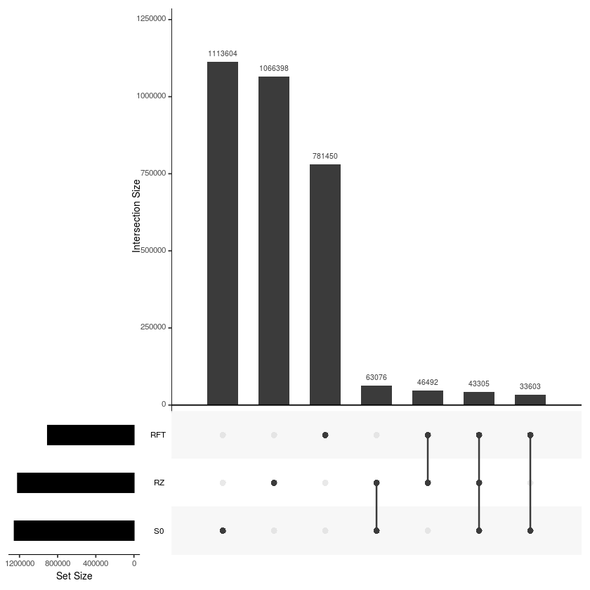

```R
library(tidyverse)
library(ggplot2)
library(vegan)
library(phyloseq)
library (ape)
library(RColorBrewer)
library(reshape2)
library(dplyr)
library(UpSetR)
library(grid)
```

    ── Attaching packages ─────────────────────────────────────── tidyverse 1.2.1 ──
    ✔ ggplot2 3.2.0       ✔ purrr   0.2.5  
    ✔ tibble  2.1.3       ✔ dplyr   0.8.0.1
    ✔ tidyr   0.8.2       ✔ stringr 1.4.0  
    ✔ readr   1.3.1       ✔ forcats 0.4.0  
    ── Conflicts ────────────────────────────────────────── tidyverse_conflicts() ──
    ✖ dplyr::filter() masks stats::filter()
    ✖ dplyr::lag()    masks stats::lag()
    Loading required package: permute
    Loading required package: lattice
    This is vegan 2.5-4
    
    Attaching package: ‘reshape2’
    
    The following object is masked from ‘package:tidyr’:
    
        smiths
    


```R
otu <- as.matrix(read.table("stl_refseq_hp_counts.tsv", header=T, row.names=1)) #tabla de OTUs sin singletons, formato tabular.  eliminados con: http://qiime.org/scripts/filter_otus_from_otu_table.html
OTU = otu_table(otu, taxa_are_rows=T)
# head(OTU)
taximat = as.matrix(read.table("stl_refseq_ontol_numerada.tsv", header=T, row.names=1)) #revisar los encabezados
taxi=tax_table(taximat)
suelos = phyloseq(OTU, taxi)
sample_names(suelos)
data= read.table("metadatos_metagenomas.txt", header=T, row.names=1, sep="\t")#los metadatos deben de estar en el mismo orden en el que estan en la tabla de OTUs:  sample_data(camaron)
head(data)
sampledata = sample_data(data.frame(id=data$id,site=data$Site,type=data$sample_type, ph=data$ph, pt=data$Pt, ct=data$Ct, nt=data$Nt, row.names=sample_names(suelos)))
# tree <- read.newick("metro.tre")
# tree <- collapse.singles(tree)
suelos = phyloseq (OTU, sampledata, taxi)
```


<ol class=list-inline>
	<li>'AGS1RFT'</li>
	<li>'AGS1RZPS'</li>
	<li>'AGS1S0'</li>
	<li>'DGO1RFT'</li>
	<li>'DGO1RZPS'</li>
	<li>'DGO1S0'</li>
	<li>'JAL5RFT'</li>
	<li>'JAL5RZPS'</li>
	<li>'JAL5S0'</li>
	<li>'NAY2RZPS'</li>
	<li>'NAY2S0'</li>
	<li>'SIN2RFT'</li>
	<li>'SIN2RZPS'</li>
	<li>'SIN2S0'</li>
	<li>'SLP1RFT'</li>
	<li>'SLP1RZPS'</li>
	<li>'SLP1S0'</li>
</ol>


<table>
<thead><tr><th></th><th scope=col>id</th><th scope=col>Site</th><th scope=col>estado</th><th scope=col>sample_type</th><th scope=col>soil_class</th><th scope=col>ph</th><th scope=col>Nt</th><th scope=col>Pt</th><th scope=col>Ct</th><th scope=col>C_N</th><th scope=col>C_P</th><th scope=col>N_P</th><th scope=col>biomass</th><th scope=col>altitude</th><th scope=col>IA</th><th scope=col>latitude</th><th scope=col>longitude</th></tr></thead>
<tbody>
	<tr><th scope=row>AGS1RFT</th><td>AGS1RFT       </td><td>AGS1          </td><td>Aguascalientes</td><td>RFT           </td><td>Planosol      </td><td>8.300         </td><td>12.456        </td><td>0.275         </td><td>22.006        </td><td>1.767         </td><td>79.901        </td><td>45.225        </td><td>0.269         </td><td>2059          </td><td>29.2          </td><td>21.8276       </td><td>-102.1208     </td></tr>
	<tr><th scope=row>AGS1RZ</th><td>AGS1RZ        </td><td>AGS1          </td><td>Aguascalientes</td><td>RZ            </td><td>Planosol      </td><td>8.048         </td><td> 5.671        </td><td>0.268         </td><td>19.616        </td><td>3.459         </td><td>73.103        </td><td>21.134        </td><td>   NA         </td><td>2059          </td><td>29.2          </td><td>21.8276       </td><td>-102.1208     </td></tr>
	<tr><th scope=row>AGS1S0</th><td>AGS1S0        </td><td>AGS1          </td><td>Aguascalientes</td><td>S0            </td><td>Planosol      </td><td>8.048         </td><td> 5.671        </td><td>0.268         </td><td>19.616        </td><td>3.459         </td><td>73.103        </td><td>21.134        </td><td>   NA         </td><td>2059          </td><td>29.2          </td><td>21.8276       </td><td>-102.1208     </td></tr>
	<tr><th scope=row>DGO1RFT</th><td>DGO1RFT       </td><td>DGO1          </td><td>Durango       </td><td>RFT           </td><td>Planosol      </td><td>8.900         </td><td>10.838        </td><td>0.248         </td><td>23.773        </td><td>2.194         </td><td>95.905        </td><td>43.721        </td><td>0.156         </td><td>1906          </td><td>33.8          </td><td>24.0062       </td><td>-104.3848     </td></tr>
	<tr><th scope=row>DGO1RZ</th><td>DGO1RZ        </td><td>DGO1          </td><td>Durango       </td><td>RZ            </td><td>Planosol      </td><td>8.857         </td><td> 5.018        </td><td>0.251         </td><td>23.360        </td><td>4.655         </td><td>92.961        </td><td>19.971        </td><td>   NA         </td><td>1906          </td><td>33.8          </td><td>24.0062       </td><td>-104.3848     </td></tr>
	<tr><th scope=row>DGO1S0</th><td>DGO1S0        </td><td>DGO1          </td><td>Durango       </td><td>S0            </td><td>Planosol      </td><td>8.857         </td><td> 5.018        </td><td>0.251         </td><td>23.360        </td><td>4.655         </td><td>92.961        </td><td>19.971        </td><td>   NA         </td><td>1906          </td><td>33.8          </td><td>24.0062       </td><td>-104.3848     </td></tr>
</tbody>
</table>


```R


```


<ol class=list-inline>
	<li>'AGS1RFT'</li>
	<li>'AGS1RZPS'</li>
	<li>'AGS1S0'</li>
	<li>'DGO1RFT'</li>
	<li>'DGO1RZPS'</li>
	<li>'DGO1S0'</li>
	<li>'JAL5RFT'</li>
	<li>'JAL5RZPS'</li>
	<li>'JAL5S0'</li>
	<li>'NAY2RZPS'</li>
	<li>'NAY2S0'</li>
	<li>'SIN2RFT'</li>
	<li>'SIN2RZPS'</li>
	<li>'SIN2S0'</li>
	<li>'SLP1RFT'</li>
	<li>'SLP1RZPS'</li>
	<li>'SLP1S0'</li>
</ol>


<table>
<thead><tr><th></th><th scope=col>id</th><th scope=col>Site</th><th scope=col>estado</th><th scope=col>sample_type</th><th scope=col>soil_class</th><th scope=col>ph</th><th scope=col>Nt</th><th scope=col>Pt</th><th scope=col>Ct</th><th scope=col>C_N</th><th scope=col>C_P</th><th scope=col>N_P</th><th scope=col>biomass</th><th scope=col>altitude</th><th scope=col>IA</th><th scope=col>latitude</th><th scope=col>longitude</th></tr></thead>
<tbody>
	<tr><th scope=row>AGS1RFT</th><td>AGS1RFT       </td><td>AGS1          </td><td>Aguascalientes</td><td>RFT           </td><td>Planosol      </td><td>8.300         </td><td>12.456        </td><td>0.275         </td><td>22.006        </td><td>1.767         </td><td>79.901        </td><td>45.225        </td><td>0.269         </td><td>2059          </td><td>29.2          </td><td>21.8276       </td><td>-102.1208     </td></tr>
	<tr><th scope=row>AGS1RZ</th><td>AGS1RZ        </td><td>AGS1          </td><td>Aguascalientes</td><td>RZ            </td><td>Planosol      </td><td>8.048         </td><td> 5.671        </td><td>0.268         </td><td>19.616        </td><td>3.459         </td><td>73.103        </td><td>21.134        </td><td>   NA         </td><td>2059          </td><td>29.2          </td><td>21.8276       </td><td>-102.1208     </td></tr>
	<tr><th scope=row>AGS1S0</th><td>AGS1S0        </td><td>AGS1          </td><td>Aguascalientes</td><td>S0            </td><td>Planosol      </td><td>8.048         </td><td> 5.671        </td><td>0.268         </td><td>19.616        </td><td>3.459         </td><td>73.103        </td><td>21.134        </td><td>   NA         </td><td>2059          </td><td>29.2          </td><td>21.8276       </td><td>-102.1208     </td></tr>
	<tr><th scope=row>DGO1RFT</th><td>DGO1RFT       </td><td>DGO1          </td><td>Durango       </td><td>RFT           </td><td>Planosol      </td><td>8.900         </td><td>10.838        </td><td>0.248         </td><td>23.773        </td><td>2.194         </td><td>95.905        </td><td>43.721        </td><td>0.156         </td><td>1906          </td><td>33.8          </td><td>24.0062       </td><td>-104.3848     </td></tr>
	<tr><th scope=row>DGO1RZ</th><td>DGO1RZ        </td><td>DGO1          </td><td>Durango       </td><td>RZ            </td><td>Planosol      </td><td>8.857         </td><td> 5.018        </td><td>0.251         </td><td>23.360        </td><td>4.655         </td><td>92.961        </td><td>19.971        </td><td>   NA         </td><td>1906          </td><td>33.8          </td><td>24.0062       </td><td>-104.3848     </td></tr>
	<tr><th scope=row>DGO1S0</th><td>DGO1S0        </td><td>DGO1          </td><td>Durango       </td><td>S0            </td><td>Planosol      </td><td>8.857         </td><td> 5.018        </td><td>0.251         </td><td>23.360        </td><td>4.655         </td><td>92.961        </td><td>19.971        </td><td>   NA         </td><td>1906          </td><td>33.8          </td><td>24.0062       </td><td>-104.3848     </td></tr>
</tbody>
</table>


```R
suelos
```


```R

```

    
    Attaching package: ‘UpSetR’
    
    The following object is masked from ‘package:lattice’:
    
        histogram
    


```R
#Función para calcular las intersecciones get_intersect_members


get_intersect_members <- function (x, ...){
  require(dplyr)
  require(tibble)
  x <- x[,sapply(x, is.numeric)][,0<=colMeans(x[,sapply(x, is.numeric)],na.rm=T) & colMeans(x[,sapply(x, is.numeric)],na.rm=T)<=1]
  n <- names(x)
  x %>% rownames_to_column() -> x
  l <- c(...)
  a <- intersect(names(x), l)
  ar <- vector('list',length(n)+1)
  ar[[1]] <- x
  i=2
  for (item in n) {
    if (item %in% a){
      if (class(x[[item]])=='integer'){
        ar[[i]] <- paste(item, '>= 1')
        i <- i + 1
      }
    } else {
      if (class(x[[item]])=='integer'){
        ar[[i]] <- paste(item, '== 0')
        i <- i + 1
      }
    }
  }
  do.call(filter_, ar) %>% column_to_rownames() -> x
  return(x)
}
```


```R
merge2 <- merge_samples(suelos,"type")
x2 <- merge2
merge2 <- as.table(t(otu_table(merge2)))
merge2 <- replace(merge2, merge2>0, 1)
write.table(merge2,"merge2.tmp")

merge2 <- read.table("merge2.tmp", header=TRUE, row.names = 1)
# head(merge2)
upset(merge2, sets=c('RFT','RZ','S0'),
      sets.bar.color ="#000000", order.by="freq", empty.intersections="on")


```


<table>
<thead><tr><th></th><th scope=col>RFT</th><th scope=col>RZ</th><th scope=col>S0</th></tr></thead>
<tbody>
	<tr><th scope=row>0000178803490f6a09275722107983b4</th><td>0</td><td>0</td><td>1</td></tr>
	<tr><th scope=row>00001aba8aee0c90a80969ea8da059f8</th><td>1</td><td>1</td><td>1</td></tr>
	<tr><th scope=row>00005c2cd063082606cf968b120f047b</th><td>0</td><td>1</td><td>0</td></tr>
	<tr><th scope=row>0000679ceb3fc9c950779468e06329a7</th><td>1</td><td>1</td><td>0</td></tr>
	<tr><th scope=row>00007d765012da6ef3076d2c392e594c</th><td>1</td><td>0</td><td>0</td></tr>
	<tr><th scope=row>0000873f3ca6ded9a6159989774b509a</th><td>1</td><td>0</td><td>1</td></tr>
</tbody>
</table>





```R
intersect0 <- get_intersect_members(merge2, c('RFT','RZ','S0'))
intersect0 <- (row.names(intersect0)) #identidades del core
vec0 <- setNames(nm=c(intersect0))
physeqsubsetOTU <- subset_taxa(x2, rownames(tax_table(x2)) %in% vec0)
physeqsubsetOTU
# tax_table(physeqsubsetOTU)
write.table((tax_table(physeqsubsetOTU)), "rft-rz-so.csv", sep="\t")

intersect0 <- get_intersect_members(merge2, c('RFT'))
intersect0 <- (row.names(intersect0)) #identidades del core
vec0 <- setNames(nm=c(intersect0))
physeqsubsetOTU <- subset_taxa(x2, rownames(tax_table(x2)) %in% vec0)
physeqsubsetOTU
# tax_table(physeqsubsetOTU)
write.table((tax_table(physeqsubsetOTU)), "rft.csv", sep="\t")


intersect0 <- get_intersect_members(merge2, c('RZ'))
intersect0 <- (row.names(intersect0)) #identidades del core
vec0 <- setNames(nm=c(intersect0))
physeqsubsetOTU <- subset_taxa(x2, rownames(tax_table(x2)) %in% vec0)
physeqsubsetOTU
# tax_table(physeqsubsetOTU)
write.table((tax_table(physeqsubsetOTU)), "rz.csv", sep="\t")


intersect0 <- get_intersect_members(merge2, c('S0'))
intersect0 <- (row.names(intersect0)) #identidades del core
vec0 <- setNames(nm=c(intersect0))
physeqsubsetOTU <- subset_taxa(x2, rownames(tax_table(x2)) %in% vec0)
physeqsubsetOTU
# tax_table(physeqsubsetOTU)
write.table((tax_table(physeqsubsetOTU)), "so.csv", sep="\t")


intersect0 <- get_intersect_members(merge2, c('RZ','S0'))
intersect0 <- (row.names(intersect0)) #identidades del core
vec0 <- setNames(nm=c(intersect0))
physeqsubsetOTU <- subset_taxa(x2, rownames(tax_table(x2)) %in% vec0)
physeqsubsetOTU
# tax_table(physeqsubsetOTU)
write.table((tax_table(physeqsubsetOTU)), "rz-so.csv", sep="\t")


intersect0 <- get_intersect_members(merge2, c('RFT','RZ'))
intersect0 <- (row.names(intersect0)) #identidades del core
vec0 <- setNames(nm=c(intersect0))
physeqsubsetOTU <- subset_taxa(x2, rownames(tax_table(x2)) %in% vec0)
physeqsubsetOTU
# tax_table(physeqsubsetOTU)
write.table((tax_table(physeqsubsetOTU)), "rft-rz.csv", sep="\t")


intersect0 <- get_intersect_members(merge2, c('RFT','S0'))
intersect0 <- (row.names(intersect0)) #identidades del core
vec0 <- setNames(nm=c(intersect0))
physeqsubsetOTU <- subset_taxa(x2, rownames(tax_table(x2)) %in% vec0)
physeqsubsetOTU
# tax_table(physeqsubsetOTU)
write.table((tax_table(physeqsubsetOTU)), "rft-so.csv", sep="\t")

```


    phyloseq-class experiment-level object
    otu_table()   OTU Table:         [ 43305 taxa and 3 samples ]
    sample_data() Sample Data:       [ 3 samples by 3 sample variables ]
    tax_table()   Taxonomy Table:    [ 43305 taxa by 1 taxonomic ranks ]


    phyloseq-class experiment-level object
    otu_table()   OTU Table:         [ 781450 taxa and 3 samples ]
    sample_data() Sample Data:       [ 3 samples by 3 sample variables ]
    tax_table()   Taxonomy Table:    [ 781450 taxa by 1 taxonomic ranks ]


    phyloseq-class experiment-level object
    otu_table()   OTU Table:         [ 1066398 taxa and 3 samples ]
    sample_data() Sample Data:       [ 3 samples by 3 sample variables ]
    tax_table()   Taxonomy Table:    [ 1066398 taxa by 1 taxonomic ranks ]


    phyloseq-class experiment-level object
    otu_table()   OTU Table:         [ 1113604 taxa and 3 samples ]
    sample_data() Sample Data:       [ 3 samples by 3 sample variables ]
    tax_table()   Taxonomy Table:    [ 1113604 taxa by 1 taxonomic ranks ]


    phyloseq-class experiment-level object
    otu_table()   OTU Table:         [ 63076 taxa and 3 samples ]
    sample_data() Sample Data:       [ 3 samples by 3 sample variables ]
    tax_table()   Taxonomy Table:    [ 63076 taxa by 1 taxonomic ranks ]


    phyloseq-class experiment-level object
    otu_table()   OTU Table:         [ 46492 taxa and 3 samples ]
    sample_data() Sample Data:       [ 3 samples by 3 sample variables ]
    tax_table()   Taxonomy Table:    [ 46492 taxa by 1 taxonomic ranks ]


    phyloseq-class experiment-level object
    otu_table()   OTU Table:         [ 33603 taxa and 3 samples ]
    sample_data() Sample Data:       [ 3 samples by 3 sample variables ]
    tax_table()   Taxonomy Table:    [ 33603 taxa by 1 taxonomic ranks ]


```R

```


```R

```


```R
#Core tomato
tomatoes <- subset_samples(suelos, type=="RFT")
# tomatoes_clean_table <- otu_table(prune_taxa(taxa_sums(tomatoes) >1, tomatoes))
tomatoes_clean <- (prune_taxa(taxa_sums(tomatoes) >1, tomatoes))

tomatoes
tomatoes_clean

         
merge2 <- tomatoes_clean
x2 <- merge2
merge2 <- as.table((otu_table(merge2))) #en este punto revisar si hay que transponer o no los datos
merge2 <- replace(merge2, merge2>0, 1)
write.table(merge2,"merge2.tmp")
merge2 <- read.table("merge2.tmp", header=TRUE, row.names = 1)
# head(merge2)
upset(merge2, sets=c("AGS1RFT","DGO1RFT","JAL5RFT","SIN2RFT","SLP1RFT"),
      sets.bar.color ="#000000", order.by="freq", empty.intersections="on")

intersect0 <- get_intersect_members(merge2, c("AGS1RFT","DGO1RFT","JAL5RFT","SIN2RFT","SLP1RFT"))
intersect0 <- (row.names(intersect0)) #identidades del core
vec0 <- setNames(nm=c(intersect0))
physeqsubsetOTU <- subset_taxa(x2, rownames(tax_table(x2)) %in% vec0)
physeqsubsetOTU
# tax_table(physeqsubsetOTU)
write.table((tax_table(physeqsubsetOTU)), "Tomato_Core.csv", sep="\t")
```


    phyloseq-class experiment-level object
    otu_table()   OTU Table:         [ 3147928 taxa and 5 samples ]
    sample_data() Sample Data:       [ 5 samples by 3 sample variables ]
    tax_table()   Taxonomy Table:    [ 3147928 taxa by 2 taxonomic ranks ]


    phyloseq-class experiment-level object
    otu_table()   OTU Table:         [ 500862 taxa and 5 samples ]
    sample_data() Sample Data:       [ 5 samples by 3 sample variables ]
    tax_table()   Taxonomy Table:    [ 500862 taxa by 2 taxonomic ranks ]


    phyloseq-class experiment-level object
    otu_table()   OTU Table:         [ 2762 taxa and 5 samples ]
    sample_data() Sample Data:       [ 5 samples by 3 sample variables ]
    tax_table()   Taxonomy Table:    [ 2762 taxa by 2 taxonomic ranks ]


```R
# sample_data(suelos           )
soils <- subset_samples(suelos, type=="S0")
# tomatoes_clean_table <- otu_table(prune_taxa(taxa_sums(tomatoes) >1, tomatoes))
soils_clean <- (prune_taxa(taxa_sums(soils) >1, soils))

soils
soils_clean
         
merge2 <- soils_clean
x2 <- merge2
merge2 <- as.table((otu_table(merge2))) #en este punto revisar si hay que transponer o no los datos
merge2 <- replace(merge2, merge2>0, 1)
write.table(merge2,"merge2.tmp")
merge2 <- read.table("merge2.tmp", header=TRUE, row.names = 1)
# head(merge2)
upset(merge2, sets=c("AGS1S0","DGO1S0","JAL5S0","SIN2S0","SLP1S0","NAY2S0"),
      sets.bar.color ="#000000", order.by="freq", empty.intersections="on")

intersect1 <- get_intersect_members(merge2, c("AGS1S0","DGO1S0","JAL5S0","SIN2S0","SLP1S0","NAY2S0"))
intersect1 <- (row.names(intersect1)) #identidades del core
vec1 <- setNames(nm=c(intersect1))
physeqsubsetOTU <- subset_taxa(x2, rownames(tax_table(x2)) %in% vec1)
physeqsubsetOTU
# tax_table(physeqsubsetOTU)
write.table((tax_table(physeqsubsetOTU)), "Soil_Core.csv", sep="\t")
```


    phyloseq-class experiment-level object
    otu_table()   OTU Table:         [ 3147928 taxa and 6 samples ]
    sample_data() Sample Data:       [ 6 samples by 3 sample variables ]
    tax_table()   Taxonomy Table:    [ 3147928 taxa by 2 taxonomic ranks ]


    phyloseq-class experiment-level object
    otu_table()   OTU Table:         [ 478823 taxa and 6 samples ]
    sample_data() Sample Data:       [ 6 samples by 3 sample variables ]
    tax_table()   Taxonomy Table:    [ 478823 taxa by 2 taxonomic ranks ]


    phyloseq-class experiment-level object
    otu_table()   OTU Table:         [ 639 taxa and 6 samples ]
    sample_data() Sample Data:       [ 6 samples by 3 sample variables ]
    tax_table()   Taxonomy Table:    [ 639 taxa by 2 taxonomic ranks ]


```R
# sample_data(RZ           )
soils <- subset_samples(suelos, type=="RZ")
# tomatoes_clean_table <- otu_table(prune_taxa(taxa_sums(tomatoes) >1, tomatoes))
soils_clean <- (prune_taxa(taxa_sums(soils) >1, soils))

soils
soils_clean
         
merge2 <- soils_clean
x2 <- merge2
merge2 <- as.table((otu_table(merge2))) #en este punto revisar si hay que transponer o no los datos
merge2 <- replace(merge2, merge2>0, 1)
write.table(merge2,"merge2.tmp")
merge2 <- read.table("merge2.tmp", header=TRUE, row.names = 1)
# head(merge2)
upset(merge2, sets=c("AGS1RZPS","DGO1RZPS","JAL5RZPS","SIN2RZPS","SLP1RZPS","NAY2RZPS"),
      sets.bar.color ="#000000", order.by="freq", empty.intersections="on")

intersect2 <- get_intersect_members(merge2, c("AGS1RZPS","DGO1RZPS","JAL5RZPS","SIN2RZPS","SLP1RZPS","NAY2RZPS"))
intersect2 <- (row.names(intersect2)) #identidades del core
vec2 <- setNames(nm=c(intersect2))
physeqsubsetOTU <- subset_taxa(x2, rownames(tax_table(x2)) %in% vec2)
physeqsubsetOTU
# tax_table(physeqsubsetOTU)
write.table((tax_table(physeqsubsetOTU)), "RZ_Core.csv", sep="\t")
```


    phyloseq-class experiment-level object
    otu_table()   OTU Table:         [ 3147928 taxa and 6 samples ]
    sample_data() Sample Data:       [ 6 samples by 3 sample variables ]
    tax_table()   Taxonomy Table:    [ 3147928 taxa by 2 taxonomic ranks ]


    phyloseq-class experiment-level object
    otu_table()   OTU Table:         [ 556952 taxa and 6 samples ]
    sample_data() Sample Data:       [ 6 samples by 3 sample variables ]
    tax_table()   Taxonomy Table:    [ 556952 taxa by 2 taxonomic ranks ]


    phyloseq-class experiment-level object
    otu_table()   OTU Table:         [ 694 taxa and 6 samples ]
    sample_data() Sample Data:       [ 6 samples by 3 sample variables ]
    tax_table()   Taxonomy Table:    [ 694 taxa by 2 taxonomic ranks ]


```R
suelos
p <- plot_richness(suelos, x="type", measures=c("Shannon")) + geom_boxplot()+geom_point(size=5, alpha=1)+theme_light() + theme(axis.text.x=element_text(angle=90, hjust=1))
#p$data
a <- p$data
p
```


    phyloseq-class experiment-level object
    otu_table()   OTU Table:         [ 3147928 taxa and 17 samples ]
    sample_data() Sample Data:       [ 17 samples by 3 sample variables ]
    tax_table()   Taxonomy Table:    [ 3147928 taxa by 1 taxonomic ranks ]


```R
# write.table(a, "Shannon.csv")
metaa <- read.table("Shannon.csv", sep="\t", header=T, row.names = 1)
head(metaa)
hist(metaa$shannon)
summary(metaa$shannon)
aov.shannon = aov(shannon~type, data=metaa)
summary(aov.shannon)
TukeyHSD(aov.shannon)
```


<table>
<thead><tr><th></th><th scope=col>site</th><th scope=col>type</th><th scope=col>samples</th><th scope=col>shannon</th></tr></thead>
<tbody>
	<tr><th scope=row>AGS1RFT</th><td>AGS1    </td><td>RFT     </td><td>AGS1RFT </td><td>11.06351</td></tr>
	<tr><th scope=row>AGS1RZ</th><td>AGS1    </td><td>RZ      </td><td>AGS1RZPS</td><td>11.52938</td></tr>
	<tr><th scope=row>AGS1S0</th><td>AGS1    </td><td>S0      </td><td>AGS1S0  </td><td>11.77871</td></tr>
	<tr><th scope=row>DGO1RFT</th><td>DGO1    </td><td>RFT     </td><td>DGO1RFT </td><td>11.34938</td></tr>
	<tr><th scope=row>DGO1RZ</th><td>DGO1    </td><td>RZ      </td><td>DGO1RZPS</td><td>10.50275</td></tr>
	<tr><th scope=row>DGO1S0</th><td>DGO1    </td><td>S0      </td><td>DGO1S0  </td><td>11.67242</td></tr>
</tbody>
</table>


       Min. 1st Qu.  Median    Mean 3rd Qu.    Max. 
      10.50   11.06   11.53   11.43   11.78   12.33 


                Df Sum Sq Mean Sq F value Pr(>F)
    type         2  0.646  0.3232   1.283  0.308
    Residuals   14  3.527  0.2519               


      Tukey multiple comparisons of means
        95% family-wise confidence level
    
    Fit: aov(formula = shannon ~ type, data = metaa)
    
    $type
                diff        lwr       upr     p adj
    RZ-RFT 0.2032683 -0.5922216 0.9987582 0.7849758
    S0-RFT 0.4816802 -0.3138097 1.2771701 0.2842686
    S0-RZ  0.2784119 -0.4800580 1.0368818 0.6124702


    ##Calculating only with matches to NR-refseq


```R
otu <- as.matrix(read.table("only_matches.txt", header=T, row.names=1)) #tabla de OTUs sin singletons, formato tabular.  eliminados con: http://qiime.org/scripts/filter_otus_from_otu_table.html
OTU = otu_table(otu, taxa_are_rows=T)
# head(OTU)
taximat = as.matrix(read.table("only_matches_ontol.txt", header=T, row.names=1)) #revisar los encabezados
taxi=tax_table(taximat)
suelos = phyloseq(OTU, taxi)
sample_names(suelos)
data= read.table("metadatos_metagenomas.txt", header=T, row.names=1, sep="\t")#los metadatos deben de estar en el mismo orden en el que estan en la tabla de OTUs:  sample_data(camaron)
# head(data)
sampledata = sample_data(data.frame(id=data$id,site=data$Site,type=data$sample_type, row.names=sample_names(suelos)))
# tree <- read.newick("metro.tre")
# tree <- collapse.singles(tree)
suelos = phyloseq (OTU, sampledata, taxi)
```


<ol class=list-inline>
	<li>'AGS1RFT'</li>
	<li>'AGS1RZPS'</li>
	<li>'AGS1S0'</li>
	<li>'DGO1RFT'</li>
	<li>'DGO1RZPS'</li>
	<li>'DGO1S0'</li>
	<li>'JAL5RFT'</li>
	<li>'JAL5RZPS'</li>
	<li>'JAL5S0'</li>
	<li>'NAY2RZPS'</li>
	<li>'NAY2S0'</li>
	<li>'SIN2RFT'</li>
	<li>'SIN2RZPS'</li>
	<li>'SIN2S0'</li>
	<li>'SLP1RFT'</li>
	<li>'SLP1RZPS'</li>
	<li>'SLP1S0'</li>
</ol>


<table>
<thead><tr><th></th><th scope=col>id</th><th scope=col>Site</th><th scope=col>estado</th><th scope=col>sample_type</th><th scope=col>soil_class</th><th scope=col>ph</th><th scope=col>Nt</th><th scope=col>Pt</th><th scope=col>Ct</th><th scope=col>C_N</th><th scope=col>C_P</th><th scope=col>N_P</th><th scope=col>biomass</th><th scope=col>altitude</th><th scope=col>IA</th><th scope=col>latitude</th><th scope=col>longitude</th></tr></thead>
<tbody>
	<tr><th scope=row>AGS1RFT</th><td>AGS1RFT       </td><td>AGS1          </td><td>Aguascalientes</td><td>RFT           </td><td>Planosol      </td><td>8.300         </td><td>12.456        </td><td>0.275         </td><td>22.006        </td><td>1.767         </td><td>79.901        </td><td>45.225        </td><td>0.269         </td><td>2059          </td><td>29.2          </td><td>21.8276       </td><td>-102.1208     </td></tr>
	<tr><th scope=row>AGS1RZ</th><td>AGS1RZ        </td><td>AGS1          </td><td>Aguascalientes</td><td>RZ            </td><td>Planosol      </td><td>8.048         </td><td> 5.671        </td><td>0.268         </td><td>19.616        </td><td>3.459         </td><td>73.103        </td><td>21.134        </td><td>   NA         </td><td>2059          </td><td>29.2          </td><td>21.8276       </td><td>-102.1208     </td></tr>
	<tr><th scope=row>AGS1S0</th><td>AGS1S0        </td><td>AGS1          </td><td>Aguascalientes</td><td>S0            </td><td>Planosol      </td><td>8.048         </td><td> 5.671        </td><td>0.268         </td><td>19.616        </td><td>3.459         </td><td>73.103        </td><td>21.134        </td><td>   NA         </td><td>2059          </td><td>29.2          </td><td>21.8276       </td><td>-102.1208     </td></tr>
	<tr><th scope=row>DGO1RFT</th><td>DGO1RFT       </td><td>DGO1          </td><td>Durango       </td><td>RFT           </td><td>Planosol      </td><td>8.900         </td><td>10.838        </td><td>0.248         </td><td>23.773        </td><td>2.194         </td><td>95.905        </td><td>43.721        </td><td>0.156         </td><td>1906          </td><td>33.8          </td><td>24.0062       </td><td>-104.3848     </td></tr>
	<tr><th scope=row>DGO1RZ</th><td>DGO1RZ        </td><td>DGO1          </td><td>Durango       </td><td>RZ            </td><td>Planosol      </td><td>8.857         </td><td> 5.018        </td><td>0.251         </td><td>23.360        </td><td>4.655         </td><td>92.961        </td><td>19.971        </td><td>   NA         </td><td>1906          </td><td>33.8          </td><td>24.0062       </td><td>-104.3848     </td></tr>
	<tr><th scope=row>DGO1S0</th><td>DGO1S0        </td><td>DGO1          </td><td>Durango       </td><td>S0            </td><td>Planosol      </td><td>8.857         </td><td> 5.018        </td><td>0.251         </td><td>23.360        </td><td>4.655         </td><td>92.961        </td><td>19.971        </td><td>   NA         </td><td>1906          </td><td>33.8          </td><td>24.0062       </td><td>-104.3848     </td></tr>
</tbody>
</table>


```R
suelos
merge2 <- merge_samples(suelos,"type")
x2 <- merge2
merge2 <- as.table(t(otu_table(merge2)))
merge2 <- replace(merge2, merge2>0, 1)
write.table(merge2,"merge2.tmp")

merge2 <- read.table("merge2.tmp", header=TRUE, row.names = 1)
# head(merge2)
upset(merge2, sets=c('RFT','RZ','S0'),
      sets.bar.color ="#000000", order.by="freq", empty.intersections="on")

```


    phyloseq-class experiment-level object
    otu_table()   OTU Table:         [ 411531 taxa and 17 samples ]
    sample_data() Sample Data:       [ 17 samples by 3 sample variables ]
    tax_table()   Taxonomy Table:    [ 411531 taxa by 2 taxonomic ranks ]


```R
a <- c(2736397,411531)
a
a <- a/3147928
a

anotadas <- data.frame(relative_abundance= a, metagenome=c("predicted", "annotated"), metagenome_proteins=c("meta", "meta"))
anotadas


# rel = (anotadas$proteins, function(x) x/sum(x)
#                                    rel

ggplot(anotadas, aes(x=metagenome_proteins, y=relative_abundance, fill=metagenome))+geom_bar(stat="identity")+theme_light()
ggsave("hist_porcentage_annotated.pdf")
```


<ol class=list-inline>
	<li>2736397</li>
	<li>411531</li>
</ol>


<ol class=list-inline>
	<li>0.869269246310589</li>
	<li>0.130730753689411</li>
</ol>


<table>
<thead><tr><th scope=col>relative_abundance</th><th scope=col>metagenome</th><th scope=col>metagenome_proteins</th></tr></thead>
<tbody>
	<tr><td>0.8692692</td><td>predicted</td><td>meta     </td></tr>
	<tr><td>0.1307308</td><td>annotated</td><td>meta     </td></tr>
</tbody>
</table>


    Saving 6.67 x 6.67 in image


```R
##Shared core between tomatoes, ruderals & soils
## in this analysis the shared proteins between the sets are shown, the 308 RFT are exclusive to 
## tomato, the core of the tomato is 2762, the sum of tomato proteins in this plot is larger
## because if a single sample shares genes with soil or rft it would add to the count of tomato


vec <- c(vec0,vec1, vec2)
physeqsubsetOTU <- subset_taxa(suelos, rownames(tax_table(suelos)) %in% vec)
physeqsubsetOTU


merge2 <- merge_samples(physeqsubsetOTU,"type")
x2 <- merge2
merge2 <- as.table(t(otu_table(merge2)))
merge2 <- replace(merge2, merge2>0, 1)
write.table(merge2,"merge2.tmp")

merge2 <- read.table("merge2.tmp", header=TRUE, row.names = 1)
# head(merge2)
upset(merge2, sets=c('RFT','RZ','S0'),
      sets.bar.color ="#000000", order.by="freq", empty.intersections="on")


intersect2 <- get_intersect_members(merge2, c("RFT"))
intersect2 <- (row.names(intersect2)) #identidades del core
vec2 <- setNames(nm=c(intersect2))
physeqsubsetOTU <- subset_taxa(x2, rownames(tax_table(x2)) %in% vec2)
physeqsubsetOTU
# tax_table(physeqsubsetOTU)
write.table((tax_table(physeqsubsetOTU)), "RFT_ONLY_Core.csv", sep="\t")

intersect2 <- get_intersect_members(merge2, c("RFT","RZ"))
intersect2 <- (row.names(intersect2)) #identidades del core
vec2 <- setNames(nm=c(intersect2))
physeqsubsetOTU <- subset_taxa(x2, rownames(tax_table(x2)) %in% vec2)
physeqsubsetOTU
# tax_table(physeqsubsetOTU)
write.table((tax_table(physeqsubsetOTU)), "RFT_RZ-shared_Core.csv", sep="\t")


```


    phyloseq-class experiment-level object
    otu_table()   OTU Table:         [ 3261 taxa and 17 samples ]
    sample_data() Sample Data:       [ 17 samples by 3 sample variables ]
    tax_table()   Taxonomy Table:    [ 3261 taxa by 2 taxonomic ranks ]


    phyloseq-class experiment-level object
    otu_table()   OTU Table:         [ 308 taxa and 3 samples ]
    sample_data() Sample Data:       [ 3 samples by 3 sample variables ]
    tax_table()   Taxonomy Table:    [ 308 taxa by 2 taxonomic ranks ]


    phyloseq-class experiment-level object
    otu_table()   OTU Table:         [ 659 taxa and 3 samples ]
    sample_data() Sample Data:       [ 3 samples by 3 sample variables ]
    tax_table()   Taxonomy Table:    [ 659 taxa by 2 taxonomic ranks ]


```R
suelosCAP.ORD <- ordinate(suelos, "CAP", "bray",  ~ ct + nt + pt + ph + type)
suelosCAP.ORD


```


    Call: capscale(formula = OTU ~ ct + nt + pt + ph + type, data = data,
    distance = distance)
    
                  Inertia Proportion Rank
    Total          7.4204     1.0000     
    Constrained    3.0195     0.4069    6
    Unconstrained  4.4009     0.5931   10
    Inertia is squared Bray distance 
    Species scores projected from ‘OTU’ 
    
    Eigenvalues for constrained axes:
      CAP1   CAP2   CAP3   CAP4   CAP5   CAP6 
    0.6988 0.5363 0.5010 0.4590 0.4473 0.3771 
    
    Eigenvalues for unconstrained axes:
      MDS1   MDS2   MDS3   MDS4   MDS5   MDS6   MDS7   MDS8   MDS9  MDS10 
    0.4848 0.4792 0.4665 0.4585 0.4540 0.4399 0.4390 0.4246 0.4038 0.3507 


```R
cap_plot <- plot_ordination(suelos, suelosCAP.ORD, color="type", axes =c(1,2)) + geom_point(aes(colour = type), alpha=0.4, size=4) + geom_point(colour = "grey90", size=1.5) + theme_bw()

arrowmat <- vegan::scores(suelosCAP.ORD, display="bp")
arrowdf <- data.frame(labels=rownames(arrowmat), arrowmat)

# Define the arrow aesthetic mapping
arrow_map <- aes(xend = CAP1, 
    yend = CAP2, 
    x = 0, 
    y = 0, 
    shape = NULL, 
    color = NULL, 
    label = labels)

label_map <- aes(x = 1.3 * CAP1, 
    y = 1.3 * CAP2, 
    shape = NULL, 
    color = NULL, 
    label = labels)

arrowhead = arrow(length = unit(0.02, "npc"))

cap_plot  + 
  geom_segment(
    mapping = arrow_map, 
    size = .5, 
    data = arrowdf, 
    color = "gray", 
    arrow = arrowhead
  ) + 
  geom_text(
    mapping = label_map, 
    size = 5,  
    data = arrowdf, 
    show.legend = TRUE
  ) + 
geom_point() +geom_text(aes(label=id,hjust=0,vjust=0), size = 2.5)


an <- anova(suelosCAP.ORD, permutations=9999)
an
 ggsave("suelos_bact_ordination.pdf", width=10, height=10, units="cm") 

```

    Warning message:
    “Ignoring unknown aesthetics: label”


<table>
<thead><tr><th></th><th scope=col>Df</th><th scope=col>SumOfSqs</th><th scope=col>F</th><th scope=col>Pr(&gt;F)</th></tr></thead>
<tbody>
	<tr><th scope=row>Model</th><td> 6      </td><td>3.019534</td><td>1.143538</td><td>2e-04   </td></tr>
	<tr><th scope=row>Residual</th><td>10      </td><td>4.400864</td><td>      NA</td><td>   NA   </td></tr>
</tbody>
</table>


```R

```


```R
tipo <- get_variable(suelos, "type")
suelos_anosim <- anosim(distance(suelos, "bray"), tipo)
suelos_anosim
```


    
    Call:
    anosim(x = distance(suelos, "bray"), grouping = tipo) 
    Dissimilarity: bray 
    
    ANOSIM statistic R: 0.4568 
          Significance: 0.001 
    
    Permutation: free
    Number of permutations: 999


