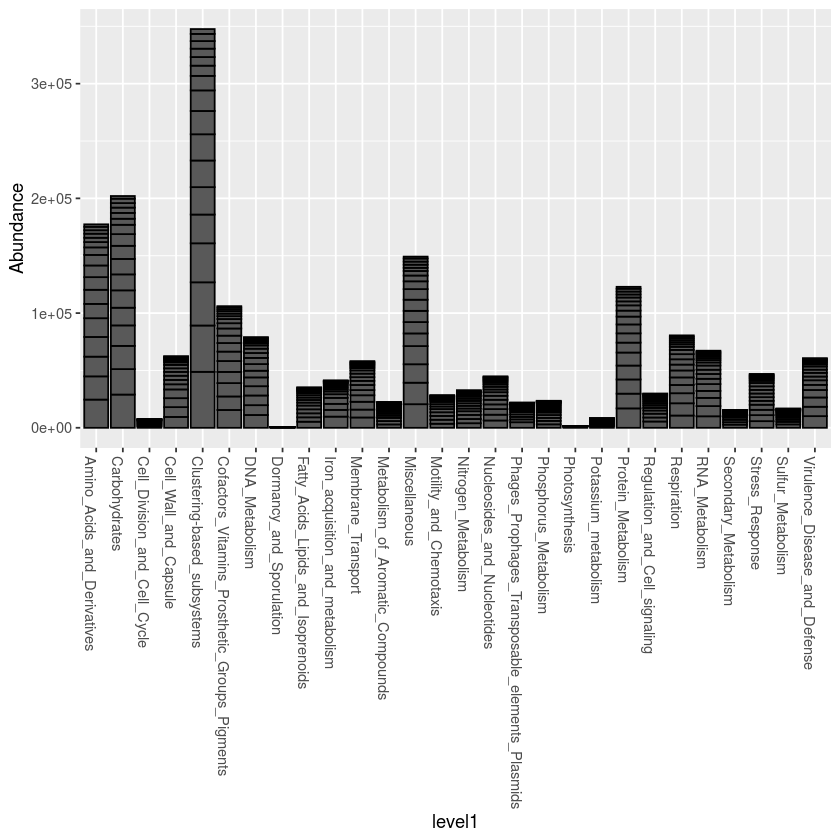
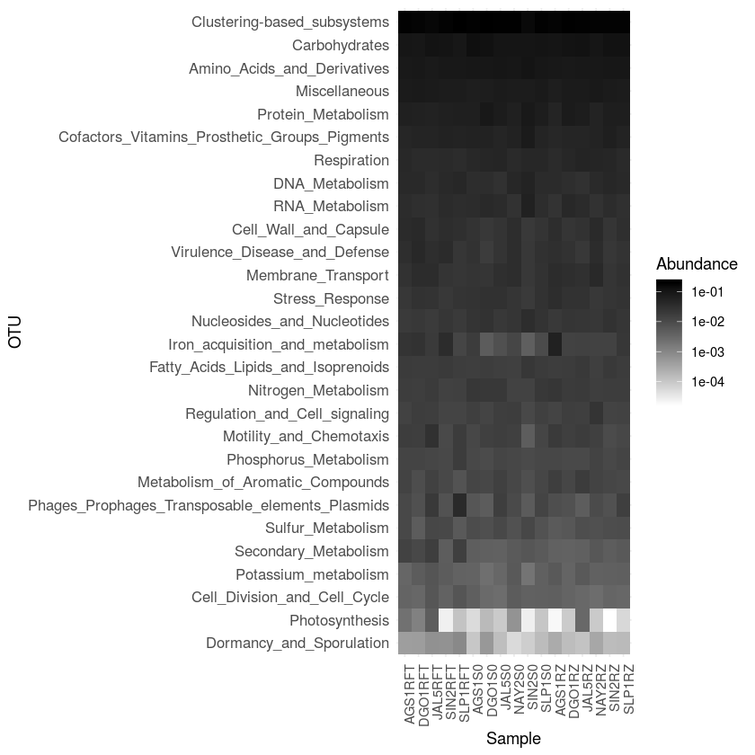

```R
library(tidyverse)
library(ggplot2)
library(vegan)
library(phyloseq)
library (ape)
library(RColorBrewer)
library(reshape2)
library(dplyr)
```

    ── Attaching packages ─────────────────────────────────────── tidyverse 1.2.1 ──
    ✔ ggplot2 3.2.0       ✔ purrr   0.2.5  
    ✔ tibble  2.1.3       ✔ dplyr   0.8.0.1
    ✔ tidyr   0.8.2       ✔ stringr 1.4.0  
    ✔ readr   1.3.1       ✔ forcats 0.4.0  
    ── Conflicts ────────────────────────────────────────── tidyverse_conflicts() ──
    ✖ dplyr::filter() masks stats::filter()
    ✖ dplyr::lag()    masks stats::lag()
    Loading required package: permute
    Loading required package: lattice
    This is vegan 2.5-4
    
    Attaching package: ‘reshape2’
    
    The following object is masked from ‘package:tidyr’:
    
        smiths
    


```R
otu <- as.matrix(read.table("so_tom_loc_counts_nr.tsv", header=T, row.names=1)) #tabla de OTUs sin singletons, formato tabular.  eliminados con: http://qiime.org/scripts/filter_otus_from_otu_table.html
OTU = otu_table(otu, taxa_are_rows=T)
head(OTU)
taximat = as.matrix(read.table("so_tom_loc_ontology_nr.tsv", header=T, row.names=1)) #revisar los encabezados
taxi=tax_table(taximat)
suelos = phyloseq(OTU, taxi)
sample_names(suelos)
data= read.table("metadatos_metagenomas.txt", header=T, row.names=1, sep="\t")#los metadatos deben de estar en el mismo orden en el que estan en la tabla de OTUs:  sample_data(camaron)
head(data)
sampledata = sample_data(data.frame(id=data$id, site=data$Site, type=data$sample_type, row.names=sample_names(suelos)))
# tree <- read.newick("metro.tre")
# tree <- collapse.singles(tree)
suelos = phyloseq (OTU, sampledata, taxi)

suelos
```


<table>
<thead><tr><th></th><th scope=col>AGS1RFT</th><th scope=col>AGS1RZ</th><th scope=col>AGS1S0</th><th scope=col>DGO1RFT</th><th scope=col>DGO1RZ</th><th scope=col>DGO1S0</th><th scope=col>JAL5RFT</th><th scope=col>JAL5RZ</th><th scope=col>JAL5S0</th><th scope=col>NAY2RZ</th><th scope=col>NAY2S0</th><th scope=col>SIN2RFT</th><th scope=col>SIN2RZ</th><th scope=col>SIN2S0</th><th scope=col>SLP1RFT</th><th scope=col>SLP1RZ</th><th scope=col>SLP1S0</th></tr></thead>
<tbody>
	<tr><th scope=row>00005c2cd063082606cf968b120f047b-SS05983</th><td>0 </td><td>1 </td><td>0 </td><td>0 </td><td>0 </td><td>0 </td><td>0 </td><td>0 </td><td>0 </td><td>0 </td><td>0 </td><td> 0</td><td>0 </td><td>0 </td><td>0 </td><td>0 </td><td>0 </td></tr>
	<tr><th scope=row>0000873f3ca6ded9a6159989774b509a-SS03591</th><td>0 </td><td>0 </td><td>0 </td><td>0 </td><td>0 </td><td>0 </td><td>2 </td><td>0 </td><td>2 </td><td>0 </td><td>0 </td><td> 0</td><td>0 </td><td>0 </td><td>0 </td><td>0 </td><td>0 </td></tr>
	<tr><th scope=row>0000aad9a8b3a9963549e03e61dc2ea6-SS02001</th><td>0 </td><td>0 </td><td>0 </td><td>0 </td><td>0 </td><td>0 </td><td>0 </td><td>0 </td><td>0 </td><td>0 </td><td>0 </td><td>34</td><td>0 </td><td>0 </td><td>0 </td><td>0 </td><td>0 </td></tr>
	<tr><th scope=row>0000f1248fa2af0022a2e1512220608b-SS01187</th><td>0 </td><td>0 </td><td>0 </td><td>2 </td><td>0 </td><td>0 </td><td>0 </td><td>0 </td><td>0 </td><td>0 </td><td>0 </td><td> 0</td><td>0 </td><td>1 </td><td>0 </td><td>0 </td><td>0 </td></tr>
	<tr><th scope=row>0001544ed073a2fc4fbaf0f5255f2b16-SS03312</th><td>0 </td><td>0 </td><td>0 </td><td>0 </td><td>0 </td><td>0 </td><td>0 </td><td>0 </td><td>0 </td><td>0 </td><td>0 </td><td> 0</td><td>1 </td><td>0 </td><td>0 </td><td>3 </td><td>1 </td></tr>
	<tr><th scope=row>00025522f88add2160113ca157542e21-SS01127</th><td>0 </td><td>0 </td><td>0 </td><td>0 </td><td>0 </td><td>0 </td><td>0 </td><td>0 </td><td>1 </td><td>0 </td><td>0 </td><td> 0</td><td>0 </td><td>0 </td><td>0 </td><td>0 </td><td>0 </td></tr>
</tbody>
</table>


<ol class=list-inline>
	<li>'AGS1RFT'</li>
	<li>'AGS1RZ'</li>
	<li>'AGS1S0'</li>
	<li>'DGO1RFT'</li>
	<li>'DGO1RZ'</li>
	<li>'DGO1S0'</li>
	<li>'JAL5RFT'</li>
	<li>'JAL5RZ'</li>
	<li>'JAL5S0'</li>
	<li>'NAY2RZ'</li>
	<li>'NAY2S0'</li>
	<li>'SIN2RFT'</li>
	<li>'SIN2RZ'</li>
	<li>'SIN2S0'</li>
	<li>'SLP1RFT'</li>
	<li>'SLP1RZ'</li>
	<li>'SLP1S0'</li>
</ol>


<table>
<thead><tr><th></th><th scope=col>id</th><th scope=col>Site</th><th scope=col>estado</th><th scope=col>sample_type</th><th scope=col>soil_class</th><th scope=col>ph</th><th scope=col>Nt</th><th scope=col>Pt</th><th scope=col>Ct</th><th scope=col>C_N</th><th scope=col>C_P</th><th scope=col>N_P</th><th scope=col>biomass</th><th scope=col>altitude</th><th scope=col>IA</th><th scope=col>latitude</th><th scope=col>longitude</th></tr></thead>
<tbody>
	<tr><th scope=row>AGS1RFT</th><td>AGS1RFT       </td><td>AGS1          </td><td>Aguascalientes</td><td>RFT           </td><td>Planosol      </td><td>8.300         </td><td>12.456        </td><td>0.275         </td><td>22.006        </td><td>1.767         </td><td>79.901        </td><td>45.225        </td><td>0.269         </td><td>2059          </td><td>29.2          </td><td>21.8276       </td><td>-102.1208     </td></tr>
	<tr><th scope=row>AGS1RZ</th><td>AGS1RZ        </td><td>AGS1          </td><td>Aguascalientes</td><td>RZ            </td><td>Planosol      </td><td>8.048         </td><td> 5.671        </td><td>0.268         </td><td>19.616        </td><td>3.459         </td><td>73.103        </td><td>21.134        </td><td>   NA         </td><td>2059          </td><td>29.2          </td><td>21.8276       </td><td>-102.1208     </td></tr>
	<tr><th scope=row>AGS1S0</th><td>AGS1S0        </td><td>AGS1          </td><td>Aguascalientes</td><td>S0            </td><td>Planosol      </td><td>8.048         </td><td> 5.671        </td><td>0.268         </td><td>19.616        </td><td>3.459         </td><td>73.103        </td><td>21.134        </td><td>   NA         </td><td>2059          </td><td>29.2          </td><td>21.8276       </td><td>-102.1208     </td></tr>
	<tr><th scope=row>DGO1RFT</th><td>DGO1RFT       </td><td>DGO1          </td><td>Durango       </td><td>RFT           </td><td>Planosol      </td><td>8.900         </td><td>10.838        </td><td>0.248         </td><td>23.773        </td><td>2.194         </td><td>95.905        </td><td>43.721        </td><td>0.156         </td><td>1906          </td><td>33.8          </td><td>24.0062       </td><td>-104.3848     </td></tr>
	<tr><th scope=row>DGO1RZ</th><td>DGO1RZ        </td><td>DGO1          </td><td>Durango       </td><td>RZ            </td><td>Planosol      </td><td>8.857         </td><td> 5.018        </td><td>0.251         </td><td>23.360        </td><td>4.655         </td><td>92.961        </td><td>19.971        </td><td>   NA         </td><td>1906          </td><td>33.8          </td><td>24.0062       </td><td>-104.3848     </td></tr>
	<tr><th scope=row>DGO1S0</th><td>DGO1S0        </td><td>DGO1          </td><td>Durango       </td><td>S0            </td><td>Planosol      </td><td>8.857         </td><td> 5.018        </td><td>0.251         </td><td>23.360        </td><td>4.655         </td><td>92.961        </td><td>19.971        </td><td>   NA         </td><td>1906          </td><td>33.8          </td><td>24.0062       </td><td>-104.3848     </td></tr>
</tbody>
</table>


    phyloseq-class experiment-level object
    otu_table()   OTU Table:         [ 138627 taxa and 17 samples ]
    sample_data() Sample Data:       [ 17 samples by 3 sample variables ]
    tax_table()   Taxonomy Table:    [ 138627 taxa by 4 taxonomic ranks ]


```R
# merge1 = merge_samples(suelos, "id")
# merge1
x2 <- tax_glom(suelos, taxrank="level1")
x2
```


    phyloseq-class experiment-level object
    otu_table()   OTU Table:         [ 28 taxa and 17 samples ]
    sample_data() Sample Data:       [ 17 samples by 3 sample variables ]
    tax_table()   Taxonomy Table:    [ 28 taxa by 4 taxonomic ranks ]


```R
#orden por valores del heatmap!
# (sample_data(x2))

t <-(tax_table(x2))[,1] #hago esto porque el melt sobre este objeto phyloseq no trabaja, creo que hay que usar psmelt para esto
write.table(t, "R_cal1.txt") 
# head(t)
t <- as.data.frame(read.table("R_taxvennupset.txt", header=T, row.names = 1))
#tener cuidado si se suman rows or columns en los pasos subsecuentes
# system("paste vennupset.txt taxvennupset.txt >coreupset.txt")
t1 <- as.data.frame(rowSums(otu_table(x2))) #para ordenar x abundancia
# read.table("coreupset.txt", header=T, sep="\t") 
# head(t1)

t3 <- merge(t,t1, by=0, all=TRUE )
# t3
names(t3)[6] <-"abundance" #revisar la columna a comparar [2]

t4 <- t3[order(-t3$abundance),]
write.table(t4, "Rcal2.txt")
 t5 <-   as.vector(t4$Row.names)
# t5
head(t4)


```


<table>
<thead><tr><th></th><th scope=col>Row.names</th><th scope=col>level1</th><th scope=col>level2</th><th scope=col>level3</th><th scope=col>level4</th><th scope=col>abundance</th></tr></thead>
<tbody>
	<tr><th scope=row>4</th><td>2061764e19149ad6aec46c956ddb15b3-SS01188     </td><td>Clustering-based_subsystems                  </td><td>NA                                           </td><td>NA                                           </td><td>NA                                           </td><td>347630                                       </td></tr>
	<tr><th scope=row>14</th><td>658c0296b7752e608b3599901b1cb007-SS04190     </td><td>Carbohydrates                                </td><td>NA                                           </td><td>NA                                           </td><td>NA                                           </td><td>202077                                       </td></tr>
	<tr><th scope=row>13</th><td>60c2cfa8313a766b99bfbe781de9b064-SS08111     </td><td>Amino_Acids_and_Derivatives                  </td><td>NA                                           </td><td>NA                                           </td><td>NA                                           </td><td>177398                                       </td></tr>
	<tr><th scope=row>12</th><td>5c56d54ab79b157eb571cd86c38dbfe0-SS03596     </td><td>Miscellaneous                                </td><td>NA                                           </td><td>NA                                           </td><td>NA                                           </td><td>149284                                       </td></tr>
	<tr><th scope=row>21</th><td>b18cbdb17f5553cf4f3456fcc865664a-SS06224     </td><td>Protein_Metabolism                           </td><td>NA                                           </td><td>NA                                           </td><td>NA                                           </td><td>122934                                       </td></tr>
	<tr><th scope=row>1</th><td>167928bd7b52f4359394d2fc01b6874b-SS03345     </td><td>Cofactors_Vitamins_Prosthetic_Groups_Pigments</td><td>NA                                           </td><td>NA                                           </td><td>NA                                           </td><td>106050                                       </td></tr>
</tbody>
</table>


```R
plot_bar(x2, "level1")
p <- plot_bar(x2, "level1")
yx <- p$data
    
    yx <- as.data.frame(yx)

yx <- yx[order(-yx$Abundance),]

sample_data(x2)

# levels1=c("AGS1RFT", "DGO1RFT", "JAL5RFT", "SIN2RFT", "SLP1RFT", "AGS1S0", "DGO1S0","JAL5S0","NAY2S0", "SIN2S0", "SPL1S0", "AGS1RZ","DGO1RZ","JAL5RZ","NAY2RZ","SIN2RZ", "SLP1RZ")
levels1=c("AGS1RFT", "DGO1RFT", "JAL5RFT", "SIN2RFT", "SLP1RFT", "AGS1S0", "DGO1S0", "JAL5S0", "NAY2S0", "SIN2S0", "SLP1S0", "AGS1RZ", "DGO1RZ", "JAL5RZ", "NAY2RZ", "SIN2RZ", "SLP1RZ")
levels1
levels2 = rev(t5)

x3 = transform_sample_counts(x2, function(x) x/sum(x))

yx$orden <- factor(yx$Sample, levels = levels1)
yx$abun <- factor(yx$OTU, levels= levels2)
# head(yx$abun)
                                   
                                     #Correción a valores vacios en Género 
    
ylabvec = as(tax_table(x2)[,"level1"], "character")
names(ylabvec) <- taxa_names(x2)
ylabvec[is.na(ylabvec)] <- ""
    
    #####

# ggplot(data=yx, aes(x = yx$orden, y= reorder(Genus, Abundance), fill= Abundance))  + 
#    geom_raster() + theme_minimal () +
#    xlab("") + ylab("") +
#    scale_fill_gradient(low="#bebebe", high="#000000", na.value = "white", trans = "log10") +
#    theme(axis.text.x = element_text( angle = 90, hjust = 1),
#          axis.text.y = element_text(size = 4.2))
                                   
plot_heatmap(x3, "NULL", sample.order=levels1, taxa.order=rev(t5)) + scale_y_discrete(labels=ylabvec)  + theme_minimal () +
   scale_fill_gradient(low="#ffffff", high="#000000", na.value = "white", trans = "log10")  +
   theme(axis.text.x = element_text( angle = 90, hjust = 1),
         axis.text.y = element_text(size = 10))

svg("heatmap_l1_samples.svg")
plot_heatmap(x3, "NULL", sample.order=levels1, taxa.order=rev(t5)) + scale_y_discrete(labels=ylabvec)  + theme_minimal () +
   scale_fill_gradient(low="#ffffff", high="#000000", na.value = "white", trans = "log10")  +
   theme(axis.text.x = element_text( angle = 90, hjust = 1),
         axis.text.y = element_text(size = 10))
dev.off()
```


<table>
<thead><tr><th></th><th scope=col>id</th><th scope=col>site</th><th scope=col>type</th></tr></thead>
<tbody>
	<tr><th scope=row>AGS1RFT</th><td>AGS1RFT</td><td>AGS1   </td><td>RFT    </td></tr>
	<tr><th scope=row>AGS1RZ</th><td>AGS1RZ </td><td>AGS1   </td><td>RZ     </td></tr>
	<tr><th scope=row>AGS1S0</th><td>AGS1S0 </td><td>AGS1   </td><td>S0     </td></tr>
	<tr><th scope=row>DGO1RFT</th><td>DGO1RFT</td><td>DGO1   </td><td>RFT    </td></tr>
	<tr><th scope=row>DGO1RZ</th><td>DGO1RZ </td><td>DGO1   </td><td>RZ     </td></tr>
	<tr><th scope=row>DGO1S0</th><td>DGO1S0 </td><td>DGO1   </td><td>S0     </td></tr>
	<tr><th scope=row>JAL5RFT</th><td>JAL5RFT</td><td>JAL5   </td><td>RFT    </td></tr>
	<tr><th scope=row>JAL5RZ</th><td>JAL5RZ </td><td>JAL5   </td><td>RZ     </td></tr>
	<tr><th scope=row>JAL5S0</th><td>JAL5S0 </td><td>JAL5   </td><td>S0     </td></tr>
	<tr><th scope=row>NAY2RZ</th><td>NAY2RZ </td><td>NAY2   </td><td>RZ     </td></tr>
	<tr><th scope=row>NAY2S0</th><td>NAY2S0 </td><td>NAY2   </td><td>S0     </td></tr>
	<tr><th scope=row>SIN2RFT</th><td>SIN2RFT</td><td>SIN2   </td><td>RFT    </td></tr>
	<tr><th scope=row>SIN2RZ</th><td>SIN2RZ </td><td>SIN2   </td><td>RZ     </td></tr>
	<tr><th scope=row>SIN2S0</th><td>SIN2S0 </td><td>SIN2   </td><td>S0     </td></tr>
	<tr><th scope=row>SLP1RFT</th><td>SLP1RFT</td><td>SLP1   </td><td>RFT    </td></tr>
	<tr><th scope=row>SLP1RZ</th><td>SLP1RZ </td><td>SLP1   </td><td>RZ     </td></tr>
	<tr><th scope=row>SLP1S0</th><td>SLP1S0 </td><td>SLP1   </td><td>S0     </td></tr>
</tbody>
</table>


<ol class=list-inline>
	<li>'AGS1RFT'</li>
	<li>'DGO1RFT'</li>
	<li>'JAL5RFT'</li>
	<li>'SIN2RFT'</li>
	<li>'SLP1RFT'</li>
	<li>'AGS1S0'</li>
	<li>'DGO1S0'</li>
	<li>'JAL5S0'</li>
	<li>'NAY2S0'</li>
	<li>'SIN2S0'</li>
	<li>'SLP1S0'</li>
	<li>'AGS1RZ'</li>
	<li>'DGO1RZ'</li>
	<li>'JAL5RZ'</li>
	<li>'NAY2RZ'</li>
	<li>'SIN2RZ'</li>
	<li>'SLP1RZ'</li>
</ol>


    Scale for 'fill' is already present. Adding another scale for 'fill', which
    will replace the existing scale.





    Scale for 'fill' is already present. Adding another scale for 'fill', which
    will replace the existing scale.


<strong>png:</strong> 2





```R
#  head(t(otu_table(x3)))
# head((tax_table(x3)))

ta <- (tax_table(x3)[,1])
ot <- (otu_table(x3))
head(ta)
head (ot)
ttt <- (psmelt(x3))[,6]
head (ttt)

# head(ttt) 
#Unir la tabla de taxonomía con los otus y con los metadatos
cphylum_stl_rel <- data.frame(cbind(ta,ot))
cphylum_stl_rel <- cphylum_stl_rel[, colSums(is.na(cphylum_stl_rel)) != nrow(cphylum_stl_rel)]   
          

tcphylum_stl_rel <- data.frame(t(cphylum_stl_rel))
# head(tcphylum_stl_rel)
# tcphylum_stl_rel <- tcphylum_stl_rel[-1,]
# head(tcphylum_stl_rel)
colnames(tcphylum_stl_rel) <- NULL


#Exportar tabla para cargar directamente sin tax_glom
write.table(tcphylum_stl_rel, "tcphylum_stl_rel.tsv", quote = TRUE, sep = "\t")

#Cargar tabla
tcphylum_stl_rel <- read.table("tcphylum_stl_rel.tsv", header = TRUE, sep = "\t")
                             
#Agregar los metadatos
microbiome <- ttt

# microbiome

mtcphylum_stl_rel <- cbind(microbiome, tcphylum_stl_rel, row.names = NULL)
# mtcphylum_stl_rel                             
#         mtcphylum_stl_rel                     
```


<table>
<thead><tr><th></th><th scope=col>level1</th></tr></thead>
<tbody>
	<tr><th scope=row>167928bd7b52f4359394d2fc01b6874b-SS03345</th><td>Cofactors_Vitamins_Prosthetic_Groups_Pigments</td></tr>
	<tr><th scope=row>17d2046a3fc5240d6c9ebe61f3528339-SS13225</th><td>Stress_Response                              </td></tr>
	<tr><th scope=row>1ff75b8fd46e41a5969bc9e7f51fcf2a-SS06840</th><td>Iron_acquisition_and_metabolism              </td></tr>
	<tr><th scope=row>2061764e19149ad6aec46c956ddb15b3-SS01188</th><td>Clustering-based_subsystems                  </td></tr>
	<tr><th scope=row>22b5006aed0e83c7e94ea20377c1de13-SS09988</th><td>Potassium_metabolism                         </td></tr>
	<tr><th scope=row>234c3e64c215614d2425943bf1117ba5-SS02020</th><td>Fatty_Acids_Lipids_and_Isoprenoids           </td></tr>
</tbody>
</table>


<table>
<thead><tr><th></th><th scope=col>AGS1RFT</th><th scope=col>AGS1RZ</th><th scope=col>AGS1S0</th><th scope=col>DGO1RFT</th><th scope=col>DGO1RZ</th><th scope=col>DGO1S0</th><th scope=col>JAL5RFT</th><th scope=col>JAL5RZ</th><th scope=col>JAL5S0</th><th scope=col>NAY2RZ</th><th scope=col>NAY2S0</th><th scope=col>SIN2RFT</th><th scope=col>SIN2RZ</th><th scope=col>SIN2S0</th><th scope=col>SLP1RFT</th><th scope=col>SLP1RZ</th><th scope=col>SLP1S0</th></tr></thead>
<tbody>
	<tr><th scope=row>167928bd7b52f4359394d2fc01b6874b-SS03345</th><td>0.047701813</td><td>0.046530753</td><td>0.057881901</td><td>0.051910288</td><td>0.049324045</td><td>0.056061854</td><td>0.051310071</td><td>0.049243788</td><td>0.048899982</td><td>0.054077612</td><td>0.058408256</td><td>0.058430392</td><td>0.065671785</td><td>0.079100120</td><td>0.053703024</td><td>0.053696418</td><td>0.052898535</td></tr>
	<tr><th scope=row>17d2046a3fc5240d6c9ebe61f3528339-SS13225</th><td>0.022268549</td><td>0.034286352</td><td>0.027345372</td><td>0.027860913</td><td>0.027776138</td><td>0.028774876</td><td>0.026464329</td><td>0.028688033</td><td>0.028794602</td><td>0.021345701</td><td>0.024884685</td><td>0.021807204</td><td>0.024922666</td><td>0.019965567</td><td>0.026159592</td><td>0.027201863</td><td>0.028552106</td></tr>
	<tr><th scope=row>1ff75b8fd46e41a5969bc9e7f51fcf2a-SS06840</th><td>0.026302306</td><td>0.059688915</td><td>0.018446451</td><td>0.027892809</td><td>0.014463664</td><td>0.004941945</td><td>0.020072138</td><td>0.014884168</td><td>0.007949713</td><td>0.014469018</td><td>0.012164803</td><td>0.036679508</td><td>0.014155883</td><td>0.004436793</td><td>0.012446230</td><td>0.023016961</td><td>0.009869603</td></tr>
	<tr><th scope=row>2061764e19149ad6aec46c956ddb15b3-SS01188</th><td>0.189199779</td><td>0.182224298</td><td>0.189497717</td><td>0.180774322</td><td>0.195348013</td><td>0.199670537</td><td>0.166846053</td><td>0.187732565</td><td>0.194213348</td><td>0.185303441</td><td>0.195950278</td><td>0.183239842</td><td>0.182835493</td><td>0.158104972</td><td>0.199114675</td><td>0.186508112</td><td>0.188093074</td></tr>
	<tr><th scope=row>22b5006aed0e83c7e94ea20377c1de13-SS09988</th><td>0.003415884</td><td>0.005604402</td><td>0.003813823</td><td>0.005002312</td><td>0.003630675</td><td>0.002364694</td><td>0.006605812</td><td>0.005671588</td><td>0.003235348</td><td>0.004142525</td><td>0.005691502</td><td>0.005020012</td><td>0.004332292</td><td>0.001966615</td><td>0.004026476</td><td>0.004420671</td><td>0.004332481</td></tr>
	<tr><th scope=row>234c3e64c215614d2425943bf1117ba5-SS02020</th><td>0.019103833</td><td>0.017879262</td><td>0.016889788</td><td>0.018536731</td><td>0.018330480</td><td>0.017270239</td><td>0.018576793</td><td>0.020855840</td><td>0.016454058</td><td>0.016060885</td><td>0.015807990</td><td>0.020091314</td><td>0.020574388</td><td>0.022401720</td><td>0.017564774</td><td>0.018699439</td><td>0.018872710</td></tr>
</tbody>
</table>


<ol class=list-inline>
	<li>S0</li>
	<li>RFT</li>
	<li>S0</li>
	<li>RZ</li>
	<li>S0</li>
	<li>S0</li>
</ol>

<details>
	<summary style=display:list-item;cursor:pointer>
		<strong>Levels</strong>:
	</summary>
	<ol class=list-inline>
		<li>'RFT'</li>
		<li>'RZ'</li>
		<li>'S0'</li>
	</ol>
</details>


```R
#probando anova y tukey categoría x categoría

melt_phylum_stl_rel <- melt(mtcphylum_stl_rel)
# head(melt_phylum_stl_rel)
tested_cat <- filter(melt_phylum_stl_rel, variable == "Potassium_metabolism")
tested_cat
# tested_cat
abac <- aov(value~microbiome, tested_cat)
abac

summary(abac)

TukeyHSD(abac)
```

    Using microbiome, level1 as id variables


<table>
<thead><tr><th scope=col>microbiome</th><th scope=col>level1</th><th scope=col>variable</th><th scope=col>value</th></tr></thead>
<tbody>
	<tr><td>S0                  </td><td>AGS1RFT             </td><td>Potassium_metabolism</td><td>0.003415884         </td></tr>
	<tr><td>RFT                 </td><td>AGS1RZ              </td><td>Potassium_metabolism</td><td>0.005604402         </td></tr>
	<tr><td>S0                  </td><td>AGS1S0              </td><td>Potassium_metabolism</td><td>0.003813823         </td></tr>
	<tr><td>RZ                  </td><td>DGO1RFT             </td><td>Potassium_metabolism</td><td>0.005002312         </td></tr>
	<tr><td>S0                  </td><td>DGO1RZ              </td><td>Potassium_metabolism</td><td>0.003630675         </td></tr>
	<tr><td>S0                  </td><td>DGO1S0              </td><td>Potassium_metabolism</td><td>0.002364694         </td></tr>
	<tr><td>RFT                 </td><td>JAL5RFT             </td><td>Potassium_metabolism</td><td>0.006605812         </td></tr>
	<tr><td>S0                  </td><td>JAL5RZ              </td><td>Potassium_metabolism</td><td>0.005671588         </td></tr>
	<tr><td>RZ                  </td><td>JAL5S0              </td><td>Potassium_metabolism</td><td>0.003235348         </td></tr>
	<tr><td>RZ                  </td><td>NAY2RZ              </td><td>Potassium_metabolism</td><td>0.004142525         </td></tr>
	<tr><td>RZ                  </td><td>NAY2S0              </td><td>Potassium_metabolism</td><td>0.005691502         </td></tr>
	<tr><td>RFT                 </td><td>SIN2RFT             </td><td>Potassium_metabolism</td><td>0.005020012         </td></tr>
	<tr><td>RZ                  </td><td>SIN2RZ              </td><td>Potassium_metabolism</td><td>0.004332292         </td></tr>
	<tr><td>RZ                  </td><td>SIN2S0              </td><td>Potassium_metabolism</td><td>0.001966615         </td></tr>
	<tr><td>RFT                 </td><td>SLP1RFT             </td><td>Potassium_metabolism</td><td>0.004026476         </td></tr>
	<tr><td>RFT                 </td><td>SLP1RZ              </td><td>Potassium_metabolism</td><td>0.004420671         </td></tr>
	<tr><td>S0                  </td><td>SLP1S0              </td><td>Potassium_metabolism</td><td>0.004332481         </td></tr>
	<tr><td>S0                  </td><td>AGS1RFT             </td><td>Potassium_metabolism</td><td>0.003415884         </td></tr>
	<tr><td>S0                  </td><td>AGS1RZ              </td><td>Potassium_metabolism</td><td>0.005604402         </td></tr>
	<tr><td>RZ                  </td><td>AGS1S0              </td><td>Potassium_metabolism</td><td>0.003813823         </td></tr>
	<tr><td>RZ                  </td><td>DGO1RFT             </td><td>Potassium_metabolism</td><td>0.005002312         </td></tr>
	<tr><td>RZ                  </td><td>DGO1RZ              </td><td>Potassium_metabolism</td><td>0.003630675         </td></tr>
	<tr><td>RFT                 </td><td>DGO1S0              </td><td>Potassium_metabolism</td><td>0.002364694         </td></tr>
	<tr><td>RZ                  </td><td>JAL5RFT             </td><td>Potassium_metabolism</td><td>0.006605812         </td></tr>
	<tr><td>S0                  </td><td>JAL5RZ              </td><td>Potassium_metabolism</td><td>0.005671588         </td></tr>
	<tr><td>S0                  </td><td>JAL5S0              </td><td>Potassium_metabolism</td><td>0.003235348         </td></tr>
	<tr><td>RFT                 </td><td>NAY2RZ              </td><td>Potassium_metabolism</td><td>0.004142525         </td></tr>
	<tr><td>S0                  </td><td>NAY2S0              </td><td>Potassium_metabolism</td><td>0.005691502         </td></tr>
	<tr><td>S0                  </td><td>SIN2RFT             </td><td>Potassium_metabolism</td><td>0.005020012         </td></tr>
	<tr><td>S0                  </td><td>SIN2RZ              </td><td>Potassium_metabolism</td><td>0.004332292         </td></tr>
	<tr><td>⋮</td><td>⋮</td><td>⋮</td><td>⋮</td></tr>
	<tr><td>RFT                 </td><td>DGO1RZ              </td><td>Potassium_metabolism</td><td>0.003630675         </td></tr>
	<tr><td>RFT                 </td><td>DGO1S0              </td><td>Potassium_metabolism</td><td>0.002364694         </td></tr>
	<tr><td>RFT                 </td><td>JAL5RFT             </td><td>Potassium_metabolism</td><td>0.006605812         </td></tr>
	<tr><td>S0                  </td><td>JAL5RZ              </td><td>Potassium_metabolism</td><td>0.005671588         </td></tr>
	<tr><td>S0                  </td><td>JAL5S0              </td><td>Potassium_metabolism</td><td>0.003235348         </td></tr>
	<tr><td>RFT                 </td><td>NAY2RZ              </td><td>Potassium_metabolism</td><td>0.004142525         </td></tr>
	<tr><td>RFT                 </td><td>NAY2S0              </td><td>Potassium_metabolism</td><td>0.005691502         </td></tr>
	<tr><td>RZ                  </td><td>SIN2RFT             </td><td>Potassium_metabolism</td><td>0.005020012         </td></tr>
	<tr><td>RZ                  </td><td>SIN2RZ              </td><td>Potassium_metabolism</td><td>0.004332292         </td></tr>
	<tr><td>RZ                  </td><td>SIN2S0              </td><td>Potassium_metabolism</td><td>0.001966615         </td></tr>
	<tr><td>S0                  </td><td>SLP1RFT             </td><td>Potassium_metabolism</td><td>0.004026476         </td></tr>
	<tr><td>RZ                  </td><td>SLP1RZ              </td><td>Potassium_metabolism</td><td>0.004420671         </td></tr>
	<tr><td>S0                  </td><td>SLP1S0              </td><td>Potassium_metabolism</td><td>0.004332481         </td></tr>
	<tr><td>RZ                  </td><td>AGS1RFT             </td><td>Potassium_metabolism</td><td>0.003415884         </td></tr>
	<tr><td>S0                  </td><td>AGS1RZ              </td><td>Potassium_metabolism</td><td>0.005604402         </td></tr>
	<tr><td>RZ                  </td><td>AGS1S0              </td><td>Potassium_metabolism</td><td>0.003813823         </td></tr>
	<tr><td>RFT                 </td><td>DGO1RFT             </td><td>Potassium_metabolism</td><td>0.005002312         </td></tr>
	<tr><td>S0                  </td><td>DGO1RZ              </td><td>Potassium_metabolism</td><td>0.003630675         </td></tr>
	<tr><td>S0                  </td><td>DGO1S0              </td><td>Potassium_metabolism</td><td>0.002364694         </td></tr>
	<tr><td>S0                  </td><td>JAL5RFT             </td><td>Potassium_metabolism</td><td>0.006605812         </td></tr>
	<tr><td>RZ                  </td><td>JAL5RZ              </td><td>Potassium_metabolism</td><td>0.005671588         </td></tr>
	<tr><td>RZ                  </td><td>JAL5S0              </td><td>Potassium_metabolism</td><td>0.003235348         </td></tr>
	<tr><td>S0                  </td><td>NAY2RZ              </td><td>Potassium_metabolism</td><td>0.004142525         </td></tr>
	<tr><td>RZ                  </td><td>NAY2S0              </td><td>Potassium_metabolism</td><td>0.005691502         </td></tr>
	<tr><td>S0                  </td><td>SIN2RFT             </td><td>Potassium_metabolism</td><td>0.005020012         </td></tr>
	<tr><td>S0                  </td><td>SIN2RZ              </td><td>Potassium_metabolism</td><td>0.004332292         </td></tr>
	<tr><td>S0                  </td><td>SIN2S0              </td><td>Potassium_metabolism</td><td>0.001966615         </td></tr>
	<tr><td>RFT                 </td><td>SLP1RFT             </td><td>Potassium_metabolism</td><td>0.004026476         </td></tr>
	<tr><td>RZ                  </td><td>SLP1RZ              </td><td>Potassium_metabolism</td><td>0.004420671         </td></tr>
	<tr><td>RZ                  </td><td>SLP1S0              </td><td>Potassium_metabolism</td><td>0.004332481         </td></tr>
</tbody>
</table>


    Call:
       aov(formula = value ~ microbiome, data = tested_cat)
    
    Terms:
                      microbiome    Residuals
    Sum of Squares  0.0000026722 0.0006623686
    Deg. of Freedom            2          473
    
    Residual standard error: 0.001183367
    Estimated effects may be unbalanced


                 Df    Sum Sq   Mean Sq F value Pr(>F)
    microbiome    2 0.0000027 1.336e-06   0.954  0.386
    Residuals   473 0.0006624 1.400e-06               


      Tukey multiple comparisons of means
        95% family-wise confidence level
    
    Fit: aov(formula = value ~ microbiome, data = tested_cat)
    
    $microbiome
                    diff           lwr          upr     p adj
    RZ-RFT -3.436611e-05 -0.0003527489 0.0002840167 0.9651228
    S0-RFT -1.728614e-04 -0.0004912442 0.0001455214 0.4091608
    S0-RZ  -1.384953e-04 -0.0004420614 0.0001650708 0.5315429


```R
# head(melt_phylum_stl_rel)
categ <- (melt_phylum_stl_rel)[,3]
categ <- categ[!duplicated(categ)]
n <- length(categ)
n
categ <- as.vector(categ)

categ[3]
categ[17]
categ[23]
#categ[1] en caso de que algo salga significativo y se quiera ver que categoría fue

anovota <- lapply(categ, function(x){
    tested_cat <- filter(melt_phylum_stl_rel, variable == as.name(x))
     aov(value~microbiome, tested_cat)
})
                  

lapply(anovota, summary)
lapply(anovota, TukeyHSD)


# lhs <- paste("abac", 1:n, sep="")
# rhs <- paste("categ[",1:n,"]", sep="")
# eq <- paste(paste(lhs,rhs, sep="<-"), collapse=";")
# eval(parse(text=eq))

# eq
# for(cc in categ){
#     print(cc)
#     abac <- aov(value~microbiome, assign(paste(sep=""),cc))
#     abac
#     summary(abac)
#     TukeyHSD(abac)
    
# }

```


28


'Iron_acquisition_and_metabolism'


'Cell_Wall_and_Capsule'


'Sulfur_Metabolism'


    Warning message in is.na(e2):
    “is.na() applied to non-(list or vector) of type 'symbol'”Warning message in is.na(e2):
    “is.na() applied to non-(list or vector) of type 'symbol'”Warning message in is.na(e2):
    “is.na() applied to non-(list or vector) of type 'symbol'”Warning message in is.na(e2):
    “is.na() applied to non-(list or vector) of type 'symbol'”Warning message in is.na(e2):
    “is.na() applied to non-(list or vector) of type 'symbol'”Warning message in is.na(e2):
    “is.na() applied to non-(list or vector) of type 'symbol'”Warning message in is.na(e2):
    “is.na() applied to non-(list or vector) of type 'symbol'”Warning message in is.na(e2):
    “is.na() applied to non-(list or vector) of type 'symbol'”Warning message in is.na(e2):
    “is.na() applied to non-(list or vector) of type 'symbol'”Warning message in is.na(e2):
    “is.na() applied to non-(list or vector) of type 'symbol'”Warning message in is.na(e2):
    “is.na() applied to non-(list or vector) of type 'symbol'”Warning message in is.na(e2):
    “is.na() applied to non-(list or vector) of type 'symbol'”Warning message in is.na(e2):
    “is.na() applied to non-(list or vector) of type 'symbol'”Warning message in is.na(e2):
    “is.na() applied to non-(list or vector) of type 'symbol'”Warning message in is.na(e2):
    “is.na() applied to non-(list or vector) of type 'symbol'”Warning message in is.na(e2):
    “is.na() applied to non-(list or vector) of type 'symbol'”Warning message in is.na(e2):
    “is.na() applied to non-(list or vector) of type 'symbol'”Warning message in is.na(e2):
    “is.na() applied to non-(list or vector) of type 'symbol'”Warning message in is.na(e2):
    “is.na() applied to non-(list or vector) of type 'symbol'”Warning message in is.na(e2):
    “is.na() applied to non-(list or vector) of type 'symbol'”Warning message in is.na(e2):
    “is.na() applied to non-(list or vector) of type 'symbol'”Warning message in is.na(e2):
    “is.na() applied to non-(list or vector) of type 'symbol'”Warning message in is.na(e2):
    “is.na() applied to non-(list or vector) of type 'symbol'”Warning message in is.na(e2):
    “is.na() applied to non-(list or vector) of type 'symbol'”Warning message in is.na(e2):
    “is.na() applied to non-(list or vector) of type 'symbol'”Warning message in is.na(e2):
    “is.na() applied to non-(list or vector) of type 'symbol'”Warning message in is.na(e2):
    “is.na() applied to non-(list or vector) of type 'symbol'”Warning message in is.na(e2):
    “is.na() applied to non-(list or vector) of type 'symbol'”


    [[1]]
                 Df  Sum Sq   Mean Sq F value Pr(>F)
    microbiome    2 0.00012 5.980e-05   1.028  0.358
    Residuals   473 0.02751 5.817e-05               
    
    [[2]]
                 Df   Sum Sq   Mean Sq F value Pr(>F)
    microbiome    2 0.000007 3.743e-06   0.319  0.727
    Residuals   473 0.005550 1.173e-05               
    
    [[3]]
                 Df  Sum Sq   Mean Sq F value Pr(>F)  
    microbiome    2 0.00089 0.0004461   2.624 0.0736 .
    Residuals   473 0.08043 0.0001700                 
    ---
    Signif. codes:  0 ‘***’ 0.001 ‘**’ 0.01 ‘*’ 0.05 ‘.’ 0.1 ‘ ’ 1
    
    [[4]]
                 Df  Sum Sq   Mean Sq F value Pr(>F)
    microbiome    2 0.00039 0.0001937   1.785  0.169
    Residuals   473 0.05133 0.0001085               
    
    [[5]]
                 Df    Sum Sq   Mean Sq F value Pr(>F)
    microbiome    2 0.0000027 1.336e-06   0.954  0.386
    Residuals   473 0.0006624 1.400e-06               
    
    [[6]]
                 Df    Sum Sq   Mean Sq F value Pr(>F)
    microbiome    2 0.0000062 3.123e-06   1.041  0.354
    Residuals   473 0.0014195 3.001e-06               
    
    [[7]]
                 Df   Sum Sq   Mean Sq F value Pr(>F)
    microbiome    2 0.000084 4.216e-05   2.052   0.13
    Residuals   473 0.009719 2.055e-05               
    
    [[8]]
                 Df    Sum Sq   Mean Sq F value Pr(>F)
    microbiome    2 0.0000045 2.226e-06    1.24   0.29
    Residuals   473 0.0008488 1.794e-06               
    
    [[9]]
                 Df   Sum Sq   Mean Sq F value Pr(>F)
    microbiome    2 0.000001 2.850e-07   0.033  0.968
    Residuals   473 0.004094 8.655e-06               
    
    [[10]]
                 Df  Sum Sq   Mean Sq F value Pr(>F)
    microbiome    2 0.00001 5.220e-06   0.131  0.878
    Residuals   473 0.01893 4.002e-05               
    
    [[11]]
                 Df    Sum Sq   Mean Sq F value Pr(>F)
    microbiome    2 0.0000094 4.694e-06   1.244  0.289
    Residuals   473 0.0017844 3.773e-06               
    
    [[12]]
                 Df   Sum Sq   Mean Sq F value Pr(>F)
    microbiome    2 0.000001 2.960e-07   0.014  0.986
    Residuals   473 0.009938 2.101e-05               
    
    [[13]]
                 Df   Sum Sq   Mean Sq F value Pr(>F)
    microbiome    2 0.000083 4.147e-05   1.163  0.313
    Residuals   473 0.016858 3.564e-05               
    
    [[14]]
                 Df  Sum Sq   Mean Sq F value Pr(>F)
    microbiome    2 0.00037 1.834e-04   1.883  0.153
    Residuals   473 0.04605 9.735e-05               
    
    [[15]]
                 Df   Sum Sq   Mean Sq F value Pr(>F)
    microbiome    2 0.000021 1.047e-05   1.326  0.267
    Residuals   473 0.003735 7.897e-06               
    
    [[16]]
                 Df   Sum Sq   Mean Sq F value Pr(>F)
    microbiome    2 0.000026 1.307e-05   0.963  0.383
    Residuals   473 0.006421 1.358e-05               
    
    [[17]]
                 Df   Sum Sq   Mean Sq F value Pr(>F)  
    microbiome    2 0.000209 1.046e-04   2.876 0.0573 .
    Residuals   473 0.017196 3.636e-05                 
    ---
    Signif. codes:  0 ‘***’ 0.001 ‘**’ 0.01 ‘*’ 0.05 ‘.’ 0.1 ‘ ’ 1
    
    [[18]]
                 Df    Sum Sq   Mean Sq F value Pr(>F)
    microbiome    2 0.0000009 4.439e-07   0.357    0.7
    Residuals   473 0.0005877 1.243e-06               
    
    [[19]]
                 Df   Sum Sq   Mean Sq F value Pr(>F)
    microbiome    2 0.000031 1.531e-05   0.581   0.56
    Residuals   473 0.012456 2.633e-05               
    
    [[20]]
                 Df   Sum Sq   Mean Sq F value Pr(>F)
    microbiome    2 0.000143 7.129e-05   1.624  0.198
    Residuals   473 0.020758 4.389e-05               
    
    [[21]]
                 Df  Sum Sq   Mean Sq F value Pr(>F)
    microbiome    2 0.00038 0.0001899   1.834  0.161
    Residuals   473 0.04897 0.0001035               
    
    [[22]]
                 Df   Sum Sq   Mean Sq F value Pr(>F)
    microbiome    2 0.000004 1.947e-06   0.104  0.901
    Residuals   473 0.008850 1.871e-05               
    
    [[23]]
                 Df   Sum Sq   Mean Sq F value Pr(>F)  
    microbiome    2 0.000037 1.851e-05   3.964 0.0196 *
    Residuals   473 0.002209 4.670e-06                 
    ---
    Signif. codes:  0 ‘***’ 0.001 ‘**’ 0.01 ‘*’ 0.05 ‘.’ 0.1 ‘ ’ 1
    
    [[24]]
                 Df   Sum Sq   Mean Sq F value Pr(>F)
    microbiome    2 0.000088 4.393e-05   1.482  0.228
    Residuals   473 0.014023 2.965e-05               
    
    [[25]]
                 Df  Sum Sq   Mean Sq F value Pr(>F)
    microbiome    2 0.00011 5.717e-05   0.809  0.446
    Residuals   473 0.03341 7.063e-05               
    
    [[26]]
                 Df    Sum Sq   Mean Sq F value Pr(>F)
    microbiome    2 2.720e-07 1.358e-07   2.271  0.104
    Residuals   473 2.829e-05 5.981e-08               
    
    [[27]]
                 Df   Sum Sq Mean Sq F value Pr(>F)
    microbiome    2 0.000002 9.5e-07     0.1  0.905
    Residuals   473 0.004493 9.5e-06               
    
    [[28]]
                 Df   Sum Sq   Mean Sq F value Pr(>F)
    microbiome    2 0.000193 9.647e-05   1.668   0.19
    Residuals   473 0.027362 5.785e-05               


    [[1]]
      Tukey multiple comparisons of means
        95% family-wise confidence level
    
    Fit: aov(formula = value ~ microbiome, data = tested_cat)
    
    $microbiome
                    diff          lwr         upr     p adj
    RZ-RFT  0.0012021852 -0.000849776 0.003254146 0.3535636
    S0-RFT  0.0009473262 -0.001104635 0.002999287 0.5235737
    S0-RZ  -0.0002548590 -0.002211327 0.001701609 0.9496151
    
    
    [[2]]
      Tukey multiple comparisons of means
        95% family-wise confidence level
    
    Fit: aov(formula = value ~ microbiome, data = tested_cat)
    
    $microbiome
                    diff           lwr          upr     p adj
    RZ-RFT -2.543587e-04 -0.0011759651 0.0006672476 0.7930843
    S0-RFT -2.917573e-04 -0.0012133636 0.0006298491 0.7372145
    S0-RZ  -3.739853e-05 -0.0009161157 0.0008413187 0.9944950
    
    
    [[3]]
      Tukey multiple comparisons of means
        95% family-wise confidence level
    
    Fit: aov(formula = value ~ microbiome, data = tested_cat)
    
    $microbiome
                    diff          lwr          upr     p adj
    RZ-RFT -0.0025792963 -0.006087744 0.0009291518 0.1956321
    S0-RFT -0.0032870242 -0.006795472 0.0002214239 0.0717353
    S0-RZ  -0.0007077279 -0.004052902 0.0026374462 0.8725795
    
    
    [[4]]
      Tukey multiple comparisons of means
        95% family-wise confidence level
    
    Fit: aov(formula = value ~ microbiome, data = tested_cat)
    
    $microbiome
                    diff          lwr          upr     p adj
    RZ-RFT -0.0021952197 -0.004998027 0.0006075881 0.1573185
    S0-RFT -0.0007750244 -0.003577832 0.0020277833 0.7923892
    S0-RZ   0.0014201953 -0.001252177 0.0040925676 0.4246973
    
    
    [[5]]
      Tukey multiple comparisons of means
        95% family-wise confidence level
    
    Fit: aov(formula = value ~ microbiome, data = tested_cat)
    
    $microbiome
                    diff           lwr          upr     p adj
    RZ-RFT -3.436611e-05 -0.0003527489 0.0002840167 0.9651228
    S0-RFT -1.728614e-04 -0.0004912442 0.0001455214 0.4091608
    S0-RZ  -1.384953e-04 -0.0004420614 0.0001650708 0.5315429
    
    
    [[6]]
      Tukey multiple comparisons of means
        95% family-wise confidence level
    
    Fit: aov(formula = value ~ microbiome, data = tested_cat)
    
    $microbiome
                    diff           lwr          upr     p adj
    RZ-RFT  2.737501e-04 -0.0001923337 0.0007398339 0.3517331
    S0-RFT  2.186537e-04 -0.0002474301 0.0006847375 0.5126927
    S0-RZ  -5.509638e-05 -0.0004994899 0.0003892971 0.9542472
    
    
    [[7]]
      Tukey multiple comparisons of means
        95% family-wise confidence level
    
    Fit: aov(formula = value ~ microbiome, data = tested_cat)
    
    $microbiome
                    diff           lwr          upr     p adj
    RZ-RFT  0.0010016102 -0.0002179463 0.0022211667 0.1311325
    S0-RFT  0.0008125768 -0.0004069797 0.0020321333 0.2612316
    S0-RZ  -0.0001890334 -0.0013518349 0.0009737681 0.9226516
    
    
    [[8]]
      Tukey multiple comparisons of means
        95% family-wise confidence level
    
    Fit: aov(formula = value ~ microbiome, data = tested_cat)
    
    $microbiome
                    diff           lwr          upr     p adj
    RZ-RFT  2.192758e-04 -0.0001411352 0.0005796869 0.3260582
    S0-RFT  3.489755e-05 -0.0003255135 0.0003953086 0.9718363
    S0-RZ  -1.843783e-04 -0.0005280167 0.0001592602 0.4177608
    
    
    [[9]]
      Tukey multiple comparisons of means
        95% family-wise confidence level
    
    Fit: aov(formula = value ~ microbiome, data = tested_cat)
    
    $microbiome
                  diff           lwr          upr     p adj
    RZ-RFT 7.54985e-05 -0.0007160371 0.0008670341 0.9726589
    S0-RFT 7.62994e-05 -0.0007152362 0.0008678350 0.9720841
    S0-RZ  8.00903e-07 -0.0007538987 0.0007555005 0.9999966
    
    
    [[10]]
      Tukey multiple comparisons of means
        95% family-wise confidence level
    
    Fit: aov(formula = value ~ microbiome, data = tested_cat)
    
    $microbiome
                    diff          lwr         upr     p adj
    RZ-RFT -0.0002628628 -0.001964812 0.001439086 0.9299107
    S0-RFT -0.0003615241 -0.002063473 0.001340425 0.8716222
    S0-RZ  -0.0000986613 -0.001721406 0.001524083 0.9887984
    
    
    [[11]]
      Tukey multiple comparisons of means
        95% family-wise confidence level
    
    Fit: aov(formula = value ~ microbiome, data = tested_cat)
    
    $microbiome
                    diff           lwr          upr     p adj
    RZ-RFT -0.0003423413 -0.0008649149 0.0001802322 0.2730772
    S0-RFT -0.0001231850 -0.0006457585 0.0003993886 0.8443595
    S0-RZ   0.0002191563 -0.0002790980 0.0007174107 0.5556808
    
    
    [[12]]
      Tukey multiple comparisons of means
        95% family-wise confidence level
    
    Fit: aov(formula = value ~ microbiome, data = tested_cat)
    
    $microbiome
                   diff          lwr         upr     p adj
    RZ-RFT 4.815429e-05 -0.001185066 0.001281375 0.9953642
    S0-RFT 8.800017e-05 -0.001145220 0.001321220 0.9846029
    S0-RZ  3.984588e-05 -0.001135983 0.001215675 0.9965064
    
    
    [[13]]
      Tukey multiple comparisons of means
        95% family-wise confidence level
    
    Fit: aov(formula = value ~ microbiome, data = tested_cat)
    
    $microbiome
                    diff           lwr         upr     p adj
    RZ-RFT  0.0009439945 -0.0006622360 0.002550225 0.3512765
    S0-RFT  0.0008849449 -0.0007212856 0.002491175 0.3984927
    S0-RZ  -0.0000590496 -0.0015905303 0.001472431 0.9954796
    
    
    [[14]]
      Tukey multiple comparisons of means
        95% family-wise confidence level
    
    Fit: aov(formula = value ~ microbiome, data = tested_cat)
    
    $microbiome
                    diff           lwr         upr     p adj
    RZ-RFT  0.0019933207 -0.0006612607 0.004647902 0.1824261
    S0-RFT  0.0018501932 -0.0008043882 0.004504775 0.2304302
    S0-RZ  -0.0001431275 -0.0026741715 0.002387917 0.9903024
    
    
    [[15]]
      Tukey multiple comparisons of means
        95% family-wise confidence level
    
    Fit: aov(formula = value ~ microbiome, data = tested_cat)
    
    $microbiome
                    diff           lwr          upr     p adj
    RZ-RFT  4.355533e-04 -0.0003205154 0.0011916221 0.3658916
    S0-RFT -6.077440e-06 -0.0007621462 0.0007499913 0.9998031
    S0-RZ  -4.416308e-04 -0.0011625140 0.0002792525 0.3210441
    
    
    [[16]]
      Tukey multiple comparisons of means
        95% family-wise confidence level
    
    Fit: aov(formula = value ~ microbiome, data = tested_cat)
    
    $microbiome
                   diff           lwr         upr     p adj
    RZ-RFT 4.712709e-04 -0.0005200465 0.001462588 0.5035959
    S0-RFT 5.477103e-04 -0.0004436071 0.001539028 0.3964268
    S0-RZ  7.643946e-05 -0.0008687446 0.001021624 0.9802672
    
    
    [[17]]
      Tukey multiple comparisons of means
        95% family-wise confidence level
    
    Fit: aov(formula = value ~ microbiome, data = tested_cat)
    
    $microbiome
                    diff          lwr          upr     p adj
    RZ-RFT -0.0013528763 -0.002975123 2.693705e-04 0.1232016
    S0-RFT -0.0015367875 -0.003159034 8.545934e-05 0.0676839
    S0-RZ  -0.0001839112 -0.001730663 1.362840e-03 0.9578399
    
    
    [[18]]
      Tukey multiple comparisons of means
        95% family-wise confidence level
    
    Fit: aov(formula = value ~ microbiome, data = tested_cat)
    
    $microbiome
                    diff           lwr          upr     p adj
    RZ-RFT -1.060244e-04 -0.0004059337 0.0001938849 0.6838455
    S0-RFT -4.141862e-05 -0.0003413279 0.0002584907 0.9435502
    S0-RZ   6.460580e-05 -0.0002213465 0.0003505581 0.8560540
    
    
    [[19]]
      Tukey multiple comparisons of means
        95% family-wise confidence level
    
    Fit: aov(formula = value ~ microbiome, data = tested_cat)
    
    $microbiome
                    diff          lwr          upr     p adj
    RZ-RFT -0.0002492179 -0.001629888 0.0011314522 0.9055268
    S0-RFT -0.0006238416 -0.002004512 0.0007568285 0.5379891
    S0-RZ  -0.0003746237 -0.001691041 0.0009417936 0.7815722
    
    
    [[20]]
      Tukey multiple comparisons of means
        95% family-wise confidence level
    
    Fit: aov(formula = value ~ microbiome, data = tested_cat)
    
    $microbiome
                    diff          lwr          upr     p adj
    RZ-RFT -0.0010461164 -0.002828478 0.0007362450 0.3522478
    S0-RFT -0.0013073621 -0.003089724 0.0004749993 0.1970701
    S0-RZ  -0.0002612457 -0.001960661 0.0014381693 0.9305404
    
    
    [[21]]
      Tukey multiple comparisons of means
        95% family-wise confidence level
    
    Fit: aov(formula = value ~ microbiome, data = tested_cat)
    
    $microbiome
                   diff           lwr         upr     p adj
    RZ-RFT 0.0014027110 -0.0013348461 0.004140268 0.4509540
    S0-RFT 0.0022181865 -0.0005193706 0.004955744 0.1383406
    S0-RZ  0.0008154755 -0.0017946828 0.003425634 0.7430830
    
    
    [[22]]
      Tukey multiple comparisons of means
        95% family-wise confidence level
    
    Fit: aov(formula = value ~ microbiome, data = tested_cat)
    
    $microbiome
                    diff          lwr          upr     p adj
    RZ-RFT -2.183249e-04 -0.001382094 0.0009454445 0.8983552
    S0-RFT -1.674843e-04 -0.001331254 0.0009962851 0.9388524
    S0-RZ   5.084063e-05 -0.001058770 0.0011604512 0.9936227
    
    
    [[23]]
      Tukey multiple comparisons of means
        95% family-wise confidence level
    
    Fit: aov(formula = value ~ microbiome, data = tested_cat)
    
    $microbiome
                    diff           lwr          upr     p adj
    RZ-RFT  0.0006774328  9.604417e-05 0.0012588213 0.0175215
    S0-RFT  0.0005044363 -7.695229e-05 0.0010858249 0.1038972
    S0-RZ  -0.0001729965 -7.273287e-04 0.0003813358 0.7435665
    
    
    [[24]]
      Tukey multiple comparisons of means
        95% family-wise confidence level
    
    Fit: aov(formula = value ~ microbiome, data = tested_cat)
    
    $microbiome
                    diff          lwr          upr     p adj
    RZ-RFT -0.0002283324 -0.001693293 0.0012366281 0.9286689
    S0-RFT -0.0010029996 -0.002467960 0.0004619609 0.2424924
    S0-RZ  -0.0007746672 -0.002171452 0.0006221178 0.3936583
    
    
    [[25]]
      Tukey multiple comparisons of means
        95% family-wise confidence level
    
    Fit: aov(formula = value ~ microbiome, data = tested_cat)
    
    $microbiome
                    diff          lwr         upr     p adj
    RZ-RFT -0.0009587651 -0.003219813 0.001302283 0.5791420
    S0-RFT  0.0001142292 -0.002146819 0.002375277 0.9922521
    S0-RZ   0.0010729943 -0.001082830 0.003228819 0.4716026
    
    
    [[26]]
      Tukey multiple comparisons of means
        95% family-wise confidence level
    
    Fit: aov(formula = value ~ microbiome, data = tested_cat)
    
    $microbiome
                    diff           lwr          upr     p adj
    RZ-RFT -5.947249e-05 -1.252698e-04 6.324875e-06 0.0858798
    S0-RFT -2.859421e-05 -9.439157e-05 3.720315e-05 0.5634836
    S0-RZ   3.087828e-05 -3.185705e-05 9.361360e-05 0.4794520
    
    
    [[27]]
      Tukey multiple comparisons of means
        95% family-wise confidence level
    
    Fit: aov(formula = value ~ microbiome, data = tested_cat)
    
    $microbiome
                    diff           lwr          upr     p adj
    RZ-RFT  1.272638e-05 -0.0008165343 0.0008419871 0.9992825
    S0-RFT -1.248427e-04 -0.0009541034 0.0007044180 0.9332860
    S0-RZ  -1.375691e-04 -0.0009282382 0.0006531000 0.9119149
    
    
    [[28]]
      Tukey multiple comparisons of means
        95% family-wise confidence level
    
    Fit: aov(formula = value ~ microbiome, data = tested_cat)
    
    $microbiome
                   diff           lwr         upr     p adj
    RZ-RFT 0.0011300914 -0.0009162380 0.003176421 0.3967631
    S0-RFT 0.0015533302 -0.0004929992 0.003599660 0.1758140
    S0-RZ  0.0004232388 -0.0015278598 0.002374337 0.8665073
    


